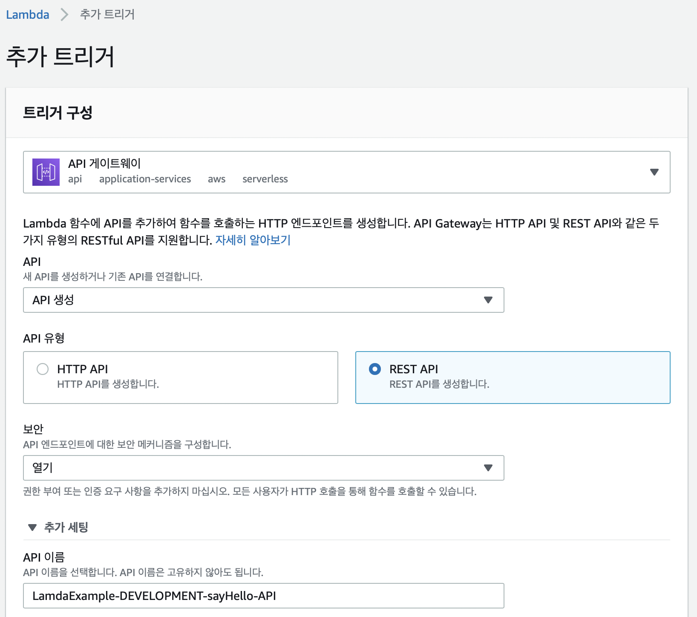

# AWS Lambda 구축하기

<h2>Basics</h2>

- AWS의 Lambda는 대표적인 Serverless 서비스이다.  
  _Serverless_ 하다는 것이 어색할 수 있지만, 말 그대로 받아들이면 된다.

- Serverless의 특성에 맞게 Lambda는 아래와 같이 **Trigger**를 발생시켰을 때 수행된다.  
  그 **Trigger**로는 스케쥴러(특정 시간에 실행)가 될 수도 있고, AWS의 API Gateway와  
  연결하여 하나의 API를 호출하는 것이 trigger가 될 수도 있다.

- 이 예시에서는 스케쥴러가 아닌, API Gateway를 사용하여 Lambda를 초 간단하게 사용해보자.

- 참고로 Serverless 답게 Lambda의 비용 청구 방식도 매우 특이한데,  
  Lambda는 기본적으로 아래의 컨셉을 가지고 있다.

> 특정 trigger에 의해 함수가 실행된다.

- 위 컨셉에 맞게 비용 청구 방식은 _함수가 수행된 시간_ 이다.

<hr/>

<h2>Starting Project</h2>

- Lambda는 실행시킬 함수에 대하여 정말 많은 언어를 지원하는데, 이번 예제에서는  
  boiler plate를 제공해주는 serverless 프레임워크를 사용해보자.  
  언어로는 TypeScript를 선택했다.

```
npm i -g serverless
```

- 위 명령으로 전역젹으로 serverless를 설치한 후, serverless가 제공하는  
  명령어를 통해 AWS Lambda를 위한 typescript로 된 boilerplate를 만들어보자.

```
serless create --template aws-nodejs-typescript --path ./Lambda_Example
```

- 위 명령어는 aws-nodejs-typescript의 boilerplate 코드를 Lambda_Example 폴더에  
  생성해준다.

- 생성해준 폴더를 보면 상당히 많은 라이브러리들이 들어가 있는데, 필요에 맞게 삭제해도 문제 없다.  
  아래는 최소한의 설정만을 담은 `package.json` 이다.

```json
{
  "name": "lambda-example",
  "version": "1.0.0",
  "description": "Serverless aws-nodejs-typescript template",
  "license": "MIT",
  "scripts": {
    "test": "echo \"Error: no test specified\" && exit 1"
  },
  "engines": {
    "node": ">=14.15.0"
  },
  "dependencies": {
    "aws-lambda": "^1.0.6"
  },
  "devDependencies": {
    "@types/aws-lambda": "^8.10.78",
    "serverless": "^2.23.0",
    "typescript": "^4.1.3",
    "serverless-plugin-typescript": "^1.1.9"
  }
}
```

- `aws-lambda`: aws lambda의 함수 형식을 작성하기 위한 라이브러리
- `@types/aws-lambda`: aws-lambda의 typescript 사용을 위한 라이브러리
- `serverless`: 로컬 환경에서 serverless 배포를 테스트하기 위한 라이브러리
- `typescript`: typescript 사용을 위한 라이브러리
- `serverless-plugin-typescript`: typescript를 serverless와 함께 사용하기 위한 라이브러리

<hr/>

<h2>Writing example code</h2>

- 이제 Lambda가 trigger되면 실제로 수행될 함수를 작성해보자.  
  `src/` 하위에 `helloWorld`라는 폴더를 만든 후, `handler.ts`를 만든다.

```ts
// handler.ts
import { Handler } from "aws-lambda";

interface Response {
  message: string;
}

const helloLambdaWorld: Handler = async () => {
  const response: Response = {
    message: "Hello, Lambda new!",
  };

  return {
    statusCode: 200,
    body: JSON.stringify(response),
  };
};

export { helloLambdaWorld };
```

- `helloLambdaWorld()` 함수가 바로 Lambda가 trigger되었을 때 실행될 함수이다.  
  이 함수를 보면 `Handler` 타입을 가지는데, aws lambda가 이 함수를 직접적으로 호출하여  
  수행할 것임을 알려준다.

- 반환하는 형식을 보면 statusCode, body가 포함된 객체를 반환하는데 이는  
  API Gateway가 반환하는 형식을 준수하여 작성한 객체이다.  
  만약 준수하지 않는다면 코드에는 문제가 없어도 아래 에러가 나면서 500이 온다.

```
Malformed Lambda proxy response
```

<hr/>

<h2>배포 과정 구축하기</h2>

- Github Action을 사용하여 배포 과정을 구축해보자.

<h3>1. IAM 계정 생성</h3>

- Github Action을 통해 AWS 리소스를 사용하기 위해서는 여느때와 마찬가지로 IAM이 필요하다.  
  프로그래밍 방식 엑세스를 선택한 후 IAM 사용자를 하나 추가해주자.  
  이때, 이 사용자에게 부여해야할 권한이 상당히 많은데, 아래와 같다.

> 참고로 기존 정책 연결 보단 새로운 정책을 직접 만들어서 전달해주자.

```json
{
  "Statement": [
    {
      "Action": [
        "apigateway:*",
        "cloudformation:CancelUpdateStack",
        "cloudformation:ContinueUpdateRollback",
        "cloudformation:CreateChangeSet",
        "cloudformation:CreateStack",
        "cloudformation:CreateUploadBucket",
        "cloudformation:DeleteStack",
        "cloudformation:Describe*",
        "cloudformation:EstimateTemplateCost",
        "cloudformation:ExecuteChangeSet",
        "cloudformation:Get*",
        "cloudformation:List*",
        "cloudformation:UpdateStack",
        "cloudformation:UpdateTerminationProtection",
        "cloudformation:ValidateTemplate",
        "ec2:DeleteInternetGateway",
        "ec2:DeleteNetworkAcl",
        "ec2:DeleteNetworkAclEntry",
        "ec2:DeleteRouteTable",
        "ec2:DeleteSecurityGroup",
        "ec2:DeleteSubnet",
        "ec2:DeleteVpc",
        "ec2:Describe*",
        "ec2:DetachInternetGateway",
        "ec2:ModifyVpcAttribute",
        "events:DeleteRule",
        "events:DescribeRule",
        "events:ListRuleNamesByTarget",
        "events:ListRules",
        "events:ListTargetsByRule",
        "events:PutRule",
        "events:PutTargets",
        "events:RemoveTargets",
        "iam:AttachRolePolicy",
        "iam:CreateRole",
        "iam:DeleteRole",
        "iam:DeleteRolePolicy",
        "iam:DetachRolePolicy",
        "iam:GetRole",
        "iam:PassRole",
        "iam:PutRolePolicy",
        "iot:CreateTopicRule",
        "iot:DeleteTopicRule",
        "iot:DisableTopicRule",
        "iot:EnableTopicRule",
        "iot:ReplaceTopicRule",
        "lambda:*",
        "logs:CreateLogGroup",
        "logs:DeleteLogGroup",
        "logs:DescribeLogGroups",
        "logs:DescribeLogStreams",
        "logs:FilterLogEvents",
        "logs:GetLogEvents",
        "logs:PutSubscriptionFilter",
        "s3:CreateBucket",
        "s3:DeleteBucket",
        "s3:DeleteBucketPolicy",
        "s3:DeleteObject",
        "s3:DeleteObjectVersion",
        "s3:GetObject",
        "s3:GetObjectVersion",
        "s3:ListAllMyBuckets",
        "s3:ListBucket",
        "s3:PutBucketNotification",
        "s3:PutBucketPolicy",
        "s3:PutBucketTagging",
        "s3:PutBucketWebsite",
        "s3:PutEncryptionConfiguration",
        "s3:PutObject",
        "states:CreateStateMachine",
        "states:DeleteStateMachine"
      ],
      "Effect": "Allow",
      "Resource": "*"
    }
  ],
  "Version": "2012-10-17"
}
```

- lambda에 대해서는 당연히 권한을 부여하는데, 그 외의 리소스들에 대해서도  
  권한을 부여해야 한다. 그 이유는 아래와 같다.

  - S3: Lambda가 실행할 파일들을 serverless는 zip 형식으로 압축하여 S3에 업로드한다.  
    따라서 S3를 사용하기 위한 권한이 필요하다.
  - CloudWatch: Lambda가 수행된 로그를 자동으로 CloudWatch에 등록하여 보여준다.  
    따라서 CloudWatch에 대한 권한이 필요하다.
  - 그 외의 권한 목록도 최소한으로 필요하다.

<h3>2. Serverless 스크립트 작성</h3>

- 이후 Github Action이 수행할 스크립트는 Serverless를 사용한다.  
  이때 serverless는 lambda에 대한 정보를 담는 스크립트를 요구하는데,  
  프로젝트 최상단에 `serverless.yml`을 만들면 된다.

```yml
# serverless.yml
service: LambdaExample
plugins:
  - serverless-plugin-typescript

provider:
  name: aws
  runtime: nodejs14.x
  stage: DEVELOPMENT
  region: ap-northeast-2
  environment:
    TZ: "Asia/Seoul"

functions:
  sayHello:
    handler: src/helloWorld/handler.helloLambdaWorld
```

- provider: 서비스 제공자에 대한 정보를 명시한다.
  - name: 제공자의 이름으로, 이 경우 AWS이므로 aws를 지정한다.
  - runtime: 코드가 실행될 런타임 환경을 지정한다.  
    typescript로 작성했으므로 nodejs를 지정해준다.
  - stage: 배포 단계를 의미하는데, 이 값은 자유롭게 부여가 가능하다.  
    예시이므로 DEVELOPMENT라고 지정했다.
  - region: AWS의 region을 지정한다.
  - environment: 환경을 지정해준다.  
    여기에 추가적인 환경 변수를 지정해줄 수도 있다.

* functions: AWS Lambda에 대한 속성을 명시한다.
  - sayHello: 이 Lambda가 실행할 함수명
  - handler: 실제로 어떤 코드가 이 함수를 실행하는지를 명시한다.

<h3>3. Workflow 스크립트 작성</h3>

- 이제 마지막으로 Github Action이 수행할 스크립트를 작성해보자.

```yml
# .github/workflows/deploy.yml
name: Deploy Lambda

on:
  push:
    branches: [master]

jobs:
  Deploy:
    runs-on: ubuntu-latest
    strategy:
      matrix:
        node-version: [14.x]
    steps:
      - name: Checkout
        uses: actions/checkout@v2

      - name: Install Packages Node ${{ matrix.node-version }}
        uses: actions/setup-node@v1
        with:
          node-version: ${{ matrix.node-version }}

      - run: yarn install --frozen-lockfile

      - name: Serverless Deploy
        uses: serverless/github-action@v2.1.0
        env:
          AWS_ACCESS_KEY_ID: ${{ secrets.AWS_ACCESS_KEY_ID }}
          AWS_SECRET_ACCESS_KEY: ${{ secrets.AWS_SECRET_ACCESS_KEY }}
        with:
          args: deploy
```

- `actions/setup-node@v1`: node 환경을 사용하기 위한 스크립트
- `yarn install --frozen-lockfile`: `npm ci`와 같은 역할을 해주는 명령어이다.
  - <a href="https://www.geeksforgeeks.org/difference-between-npm-i-and-npm-ci-in-node-js/">npm install과 npm ci의 차이점</a>
- `serverless/github-action@v2.1.0`: serverless가 제공하는 github action 스크립트이다.  
  환경변수(env)로 `AWS_ACCESS_KEY_ID`와 `AWS_SECRET_ACCESS_KEY`는 이 workflow가  
  수행될 때 사용할 AWS IAM의 정보이다. 위에서 IAM을 생성할 때 가져온 값을 사용한다.  
  가장 아래에 `with: args: deploy`가 있는데, 이는 serverless가 배포할 때 사용하는  
  명령어이다.

<hr/>

<h2>API Gateway 연결</h2>

- 배포가 성공하면 S3에 bucket이 하나 생성되어 있을 것이며 Lambda에도  
  함수 하나가 추가되어 있을 것이다.  
  Lambda 콘솔에서 트리거 추가를 이용하여 API Gateway를 손쉽게 구축할 수 있다.



- 하위 속성은 기본값을 유지해도 된다.

- API Gateway 생성 후 다시 Lambda 함수를 보면, trigger가 붙어 있다.  
  API Gateway Trigger를 가서 API 엔드포인트를 확인해보자.  
  그 엔드포인트에 요청을 보내면 아래와 같이 응답이 온다.

```json
{
  "message": "Hello, Lambda!"
}
```

<hr/>

- 소스코드: <a href="https://github.com/sang-w0o/Lambda_Example">Github</a>
