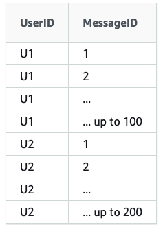
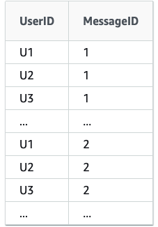

# Distributing Write Activity Efficiently During Data Upload

- 이번에는 DynamoDB가 데이터를 partition들에 나눠 저장한다는 점을 생각해, 어떻게 데이터를 upload하는 것이 좋을지 생각해보자.

- 사용자의 메시지를 DynamoDB table에 저장하는 상황을 생각해보자. `UserID`가 Partition Key로 사용되며, `MessageID`가  
  Sort Key로 사용되는 복합 PK를 가지는 table이다.

- 데이터를 upload할 때, 아래처럼 한 사용자의 모든 데이터를 보내고, 그 다음 사용자의 모든 데이터를 보내는 식으로 진행했다고 해보자.

- 위 방식의 문제점은 DynamoDB에 전송하는 write request를 Partition Key value에 따라 분배하지 않았다는 것이다.  
  이는 곧 한 사용자의 모든 데이터를 저장할 때, 모든 트래픽이 하나의 partition에 집중된다는 것이다.

- DynamoDB가 Partition Key value에 따라 데이터를 서로 다른 partition에 저장하는 특성을 적용해, 데이터를 업로드 할때도  
  workload들을 Partition Key value에 따라 분배해야 한다.

- 예를 들어, 기존 방식 대신 아래 표의 방식처럼 Sort Key를 기준으로 데이터를 보낼 수도 있을 것이다.

- 이렇게 하면 각 upload request는 이전 upload request와 다른 Partition Key value를 가지기에, 실제 저장 요청이 도착하는  
  partition도 달라지므로 트래픽이 더 균등하게 분배될 것이다.

---
