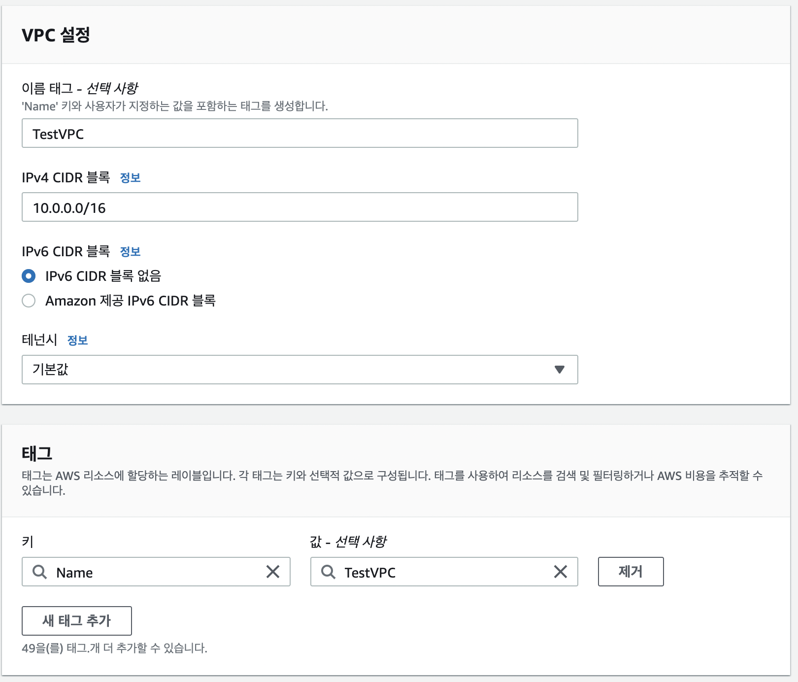

# AWS VPC

- Amazon Vitrual Private Cloud(Amazon VPC)는 AWS의 다양한 리소스들을  
  사용자가 정의한 가상 네트워크(Virtual Network)에서 실행할 수 있도록 해준다.

- 이 가상 네트워크는 온프레미스 형식의 데이터 센터로 구축된 전통적인 네트워크 구조를 매우 비슷하게 띈다.

<h2>Concepts</h2>

- 위에서 말한 *AWS의 다양한 리소스*가 EC2 인스턴스라고 했을 때, VPC는 EC2의 Networking Layer로서 작동한다.
- 아래는 간단한 VPC의 Concept이다.

- Virtual Private Cloud(VPC): AWS 계정 및 그의 리소스들에 대해 작동하는 가상 네트워크 환경
- Subnet: VPC 내의 IP 주소 범주
- Routing Table: 네트워크의 트래픽이 어디로 갈지를 정하는 규칙(Route)들로 정의된 테이블
- Internet Gateway: 외부 인터넷과 정의한 VPC 내의 리소스들의 통신(Communication)을 활성화하기 위해  
  VPC에 붙히는(attach)하는 Gateway
- CIDR(Classless Inter-Domain Routing): IP 주소와 IP Routing을 처리하기 위한 방법

<h2>VPC와 Subnet</h2>

<h3>VPC 생성하기</h3>

- AWS VPC는 VPC 콘솔에서 생성할 수 있다.  
  생성 과정 중에, IPv4 CIDR Block을 설정하는 부분이 있다.  
  CIRD Block으로 설정할 수 있는 가장 작은 단위는 `/28`이며, 가장 큰 단위는 `/16`이다.  
  AWS에서는 이 CIDR Blcok을 RFC 1918에서 지정된 Private(외부에서 접근 불가한) 형식으로 지정할 것을 권장하고 있다.  
  예를 들면, `10.0.0.0/16` 또는 `192.168.0.0/16` 등이 있다.

