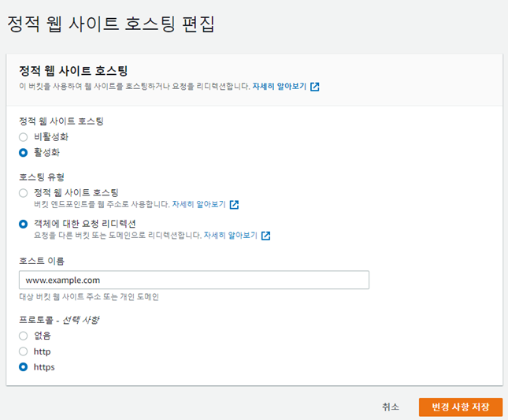

<h1>www가 없는 링크를 www로 리다이렉션 시키기</h1>

<h2>기본 전제</h2>

* AWS의 CloudFront, Route53, 그리고 S3의 정적 웹사이트 호스팅을 이용하여   
  `www.example.com`의 도메인을 사용중이라고 하자.

* 기존 상황은 사용자가 브라우저에 `www.example.com`으로 접속할 때와 `example.com`으로   
  접속할 때를 대비하여 각 상황에 대한 S3 bucket이 각각 있었고, CloudFront 배포도   
  각각 있었다.

* 내가 원하는 것은 사용자가 url에 `https://example.com`을 직접 입력했을 때 자동으로   
  `https://www.example.com`으로 리다이렉션이 이루어지는 것이었다.

* 참고로 S3의 정적 웹 호스팅은 https 프로토콜을 지원하지 않기 때문에, https를 사용하려면   
  꼭 CloudFront 배포가 포함되어야 한다.

<h2>문제 해결</h2>

<h3>S3 버킷 생성 및 속성 제어</h3>

* 우선 `example.com`의 이름으로 된 S3 버킷을 만든다.   
  그 후 `속성` 탭의 하단에 가서 `정적 웹 호스팅`에 대한 편집 버튼을 누른다.
  * 참고로 이 설명은 `www.example.com`에 대한 CloudFront배포, Route 53설정, S3 버킷 속성이   
    모두 잘 동작하고 있다는 가정하에 진행된다.

* 편집창으로 가서 정적 웹 호스팅을 활성화하고, 호스팅 유형을 `객체에 대한 요청 리디렉션`으로   
  지정한다. 나는 https를 사용할 것이므로 프로토콜은 https를 선택했다.

<h3>CloudFront 배포 진행</h3>

* 다음으로 할 작업은 CloudFront 배포를 생성하는 것이다.   
  `Origin Domain Name`에는 위에서 생성한 S3 버킷의 웹 엔드포인트 URL을 복사하여 붙여넣는다.   
  __클릭시 나오는 S3 버킷 목록에는 region 정보가 없어 꼭 수동으로 복붙해야 한다__.

* `Redirect HTTP to HTTPS`를 선택한 후 배포를 생성한다.

<h3>Route 53 설정</h3>

* 위의 CloudFront 배포가 완료되면 `abcd.cloudfront.net` 형식의 주소가 나올 것이다.
* 이제 Route 53 콘솔로 가서 `example.com`의 호스팅 영역에 대해 `단순 레코드 정의`를 수행한다.

* `단순 라우팅`을 선택한 후 나오는 창에서 `레코드 이름`은 공란으로 둔다.
* `값/트래픽 라우팅 대상`에서는 `CloudFront 배포에 대한 별칭`을 입력한 후 리전은   
  CloudFront 배포를 수행한 리전을 선택한다. 그러면 아래 칸에 위의 CloudFront 배포에서 나온   
  `abcd.cloudfront.net`의 주소를 선택하면 된다.

<h2>해결</h2>

* 이제 브라우저의 URL에 직접 `https://example.com`을 입력해도 자동으로   
  `https://www.example.com`으로 이동하게 됨을 알 수 있다.

