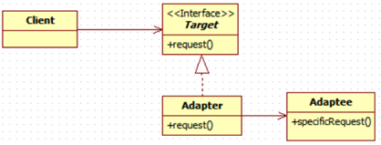

<h1>어댑터 패턴</h1>

<h2>어댑터</h2>

* 객체지향에서의 어댑터는 실생활에서 쓰이는 어댑터와 동일한 기능을 제공한다.

* 어떤 소프트웨어 시스템이 있는데, 새로운 업체에서 제공한 클래스 라이브러리를 사용해야 한다고 해보자.   
  하지만 새로 채택한 업체에서 사용하는 인터페이스가 기존 업체에서 사용하던 인터페이스와 다르다고 가정해보자.

* 그런데 기존 코드를 바꿔서 문제를 해결할 수는 없다. 업체에서 공급받은 클래스도 변경할 수 없다.   
  그렇다면 __새로 사용하기로한 업체에서 사용하는 인터페이스를 기존에 사용하던 인터페이스에 적응시켜주는 클래스를 만들어야 한다__.

* 즉, 어댑터는 클라이언트로부터 요청을 받아서 새로운 업체에서 제공하는 클래스에서 받아들일 수 있는 형태의 요청으로   
  변환시켜주는 중개인 역할을 한다.
<hr/>

<h2>예시 시나리오</h2>

* 어댑터를 어떻게 사용하는지 살펴보자.
* 먼저 `Duck`라는 인터페이스가 있다.
```java
public interface Duck {
    public void quack();
    public void fly();
}
```

* 그리고 위의 `Duck` 클래스를 구현하는 `MallardDuck`이 있다.
```java
public class MallardDuck implements Duck {
    public void quack() {
        System.out.println("QUACK");
    }

    public void fly() {
        System.out.println("FLY");
    }
}
```

* 위 두 개의 코드가 기존 업체가 가지고 있던 코드이고, 아래의 클래스가 새로운 업체에서 제공한 클래스라 해보자.
```java
public interface Turkey{
    public void gobble();
    public void fly();
}

public class WildTurkey implements Turkey {
    public void gobble() {
        System.out.println("GOBBLE");
    }

    public void fly() {
        System.out.println("FLY");
    }
}
```

* `Duck` 객체가 모자라서 `Turkey` 객체를 대신 사용해야 하는 상황이라고 해보자.   
  `Duck`과 `Turkey`는 다른 인터페이스이므로 `Duck`에 바로 `Turkey` 구현 클래스를 적용할 수는 없다.   
  아래 코드를 살펴보자.
```java
public class TurkeyAdapter implements Duck {

    Turkey turkey;

    public TurkeyAdapter(Turkey turkey) {this.turkey = turkey;}

    public void quack() { 
        turkey.gobble();
    }

    public void fly() {
        for(int i = 0; i < 5; i++) {
            turkey.fly();
        }
    }
}
```

* 위의 `TurkeyAdapter`가 어댑터 클래스이다. 이제 `TurkeyAdapter`를 사용하여 `Turkey`가 `Duck`을 대체할 수 있다.
* `Duck` 인터페이스가 Target에 해당하며, `Turkey`객체가 Adaptee에 해당한다.
<hr/>

<h2>클라이언트에서 어댑터를 사용하는 방법</h2>

1. 클라이언트에서 타겟 인터페이스를 사용하여 메소드를 호출함으로써 어댑터에 요청을 한다.
2. 어댑터에서는 어댑티 인터페이스를 사용하여 그 요청을 어댑티에 대한 하나 이상의 메소드 호출로 변환한다.
  * ex) 위 코드에서 `TurkeyAdapter#quack()`이 `Turkey#gobble()`을 호출하는 부분
3. 클라이언트에서는 호출 결과를 받긴 하지만 중간에 어댑터가 껴있는지에 대해서는 알지 못한다.
<hr/>

<h2>Adapter Pattern이란?</h2>

* 정의 : 한 클래스의 인터페이스를 클라이언트에서 사용하고자 하는 다른 인터페이스로 변환한다.   
  어댑터를 이용하면 인터페이스 호환성 문제 때문에 같이 쓸 수 없는 클래스들을 연결해서 쓸 수 있다.

* 이 패턴을 이용하면 호환되지 않는 인터페이스를 사용하는 클라이언트를 그대로 활용할 수 있다.   
  인터페이스를 변환해주는 어댑터를 만들면 된다. 이렇게 함으로써 클라이언트와 구현된 인터페이스를 분리시킬 수 있으며,   
  나중에 인터페이스가 바뀌더라도 그 변경 내역은 어댑터에 캡슐화되기 때문에 클라이언트는 바뀔 필요가 없다.

* 아래는 어댑터 패턴이 적용된 간단한 클래스 다이어그램이다.



* 어댑터 패턴에는 여러 객체지향 원칙이 반영되어 있다. 어댑티를 새로 바뀐 인터페이스로 감쌀 때는 객체 구성(Composition)을   
  사용한다. 이런 접근법을 쓰면 어댑티의 어떤 서브클래스에 대해서도 어댑터를 쓸 수 있다는 장점이 있다.

* 그리고 이 패턴에서는 클라이언트를 특정 구현이 아닌 인터페이스에 연결시킨다. 각각 서로 다른 백엔드 클래스들로   
  변환시키는 여러 어댑터를 사용할 수도 있다. 이렇게 인터페이스를 기준으로 코딩했기 때문에 타겟 인터페이스만 제대로 지킨다면   
  나중에 다른 구현을 추가하는 것도 가능하다.
<hr/>

