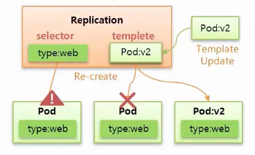
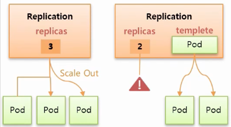
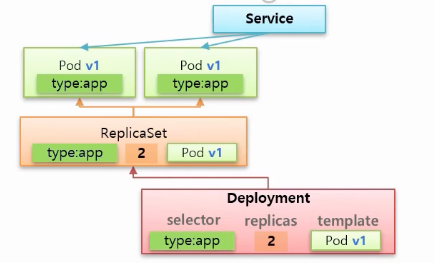
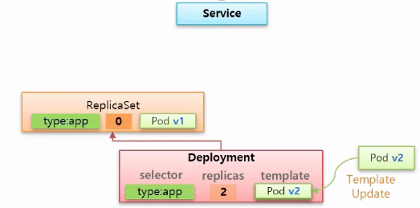
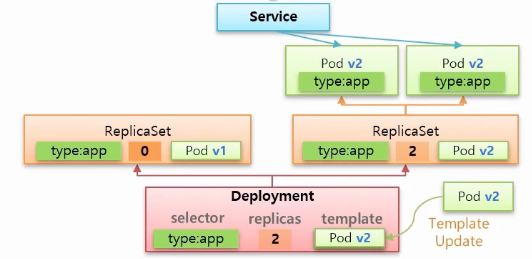
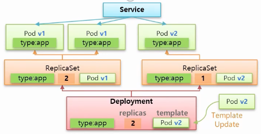
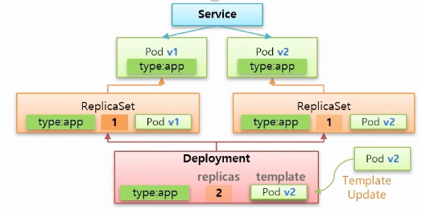
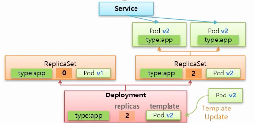

# Controllers

## Replication Controller, ReplicaSet - Template, Replicas, Selector

### K8S의 Controller

- K8S의 `Controller`는 `Service`를 관리 및 운영하는 데 큰 도움을 준다. 어떤 기능들을 제공하는지 보자.

  - **Auto Healing** : 만약 Node1내에 Pod1이 있는데 Pod1에 문제가 생기거나 Node1이 다운되면,  
    해당 `Service`에도 영향이 끼쳐진다. `Controller`는 이를 바로 감지하고, 새로운 `Node`(Node2)에 Pod1을 다시 생성해준다.

  - **Software Update**: 여러 개의 `Pod`의 버전을 업그레이드해야 할 경우, `Controller`를 통해 한 번에 쉽게  
    수행할 수 있다. 또한 업그레이드 도중 문제가 생기면 롤백할 수 있는 기능까지 제공한다.

  - **Auto Scaling** : 예를 들어 `Pod`의 리소스가 한계치에 도달했을 때 `Controller`는 이 상태를 파악하고
    동일한 `Pod`를 하나 더 만들어줌으로써 부하를 분산시키고 `Pod`가 죽지 않게 해준다. 그렇게 된다면 서비스는  
    성능 문제 없이 안정적으로 작동할 수 있다.

  - **Job**: 일시적인 작업을 해야 할 경우, `Controller`가 특정 시점에만 해당 작업을 수행할 `Pod`를 만들어  
    작업을 수행하고, 작업이 완료되면 자동으로 작업을 삭제해준다. 작업 순간에만 자원을 사용하고, 작업이 완료되면  
    자원이 반환되기에 효율적인 자원 사용이 가능하다.

### Replication Controller, ReplicaSet

> `Replication Controller`는 Deprecated되었고, 이를 대체하는 `ReplicaSet`을 사용하자.

### Template

- `Controller`와 `Pod`는 `Service`와 `Pod`처럼 `Label`과 Selector로 연결된다. `type:web`이라는 `Label`이  
  붙어있는 `Pod`가 있다 하자. `Controller`에 `type:web`이라는 Selector를 주면, 이 둘은 연결된다.  
  이때 `Controller`를 만들 때 `Template`에 `Pod`의 내용을 넣을 수 있다. 이전에 `Controller`는 `Pod`가 죽으면  
  재생성시킨다는 Auto Healing기능이 있다고 했다. 기존 `Pod`가 죽어 새로운 `Pod`를 만들 때는 `Template`을 사용해  
  만들게 된다.

- 위와 같은 특성을 사용해 업그레이드를 진행할 수 있다.

- yml 파일을 보자.

```yml
# yml file for Pod
apiVersion: v1
kind: Pod
metadata:
  name: pod-1
  labels:
    type: web
spec:
  containers:
    - name: container
      image: app/v1


# yml file for Controller
apiVersion: v1
kind: ReplicationController
metadata:
  name: replication-1
spec:
  replicas: 1
  selector:
    type: web
  template:
    metadata:
      name: pod-1
      labels:
        type: web
    spec:
      containers:
      - name: container
      	image: app/v2
```



### Replicas

- `Replicas`의 기능은 간단하다. `Replicas`에 지정된 숫자 만큼의 `Pod`의 개수가 관리된다.  
  지정된 숫자만큼 재생성, Scale-Out, Scale-In 등을 할 수 있다. yml을 보자.

```yml
# yml file for Pod
apiVersion: v1
kind: Pod
metadata:
  name: pod-1
  labels:
    type: web
spec:
  containers:
    - name: container
      image: app/v1


# yml file for Controller
apiVersion: v1
kind: ReplicationController
metadata:
  name: replication-1
spec:
  replicas: 3
  selector:
    type: web
  template:
    metadata:
      name: pod-1
      labels:
        type: web
    spec:
      containers:
      - name: container
      	image: app/v2
```

> 하나의 `Namespace`에 name이 같은 `Pod`가 여러 개 들어갈 수 없다.  
> 위 yml 파일 중 `Controller`를 위한 파일에서 template에는 `Pod`의 name이 들어있다.  
> 이렇게 실행하면 어떻게 될까? 답은 K8S가 알아서 임의의 문자열을 추가해 name의 중복을 없애준다는 것이다.

- 또한 `Template` 기능과 `Replicas` 기능을 함께 사용해 `Pod`와 `Controller`를 따로 만들지 않고  
  한 번에 만들 수 있다. 실제로 `Controller`를 사용할 때 `Pod`는 만들지 않고, `Controller`에 대한  
  내용만 만들어 사용한다.



- 기본적으로 위 yml파일을 실행하면 이름이 replication-1인 `Controller`와 3개의 `Pod`가 생성된다.  
  이 상태에서 `Pod`를 지우면 spec.replicas에 지정된 개수만큼 재생성되는데, **`Controller`를 지우게 된다면**  
  **해당 `Controller`에 연결된 모든 `Pod`도 함께 삭제된다.** 이를 비활성화하고 싶다면  
  직접 master에 접속해 kubectl 명령어로 `Controller`를 지우고, 이때 `--cascase=false` 옵션을 지정하면 된다.

```sh
kubectl delete replicationcontrollers replication-1 --cascade=false
```

- 추가적으로 직접 명령 인자 옵션을 주는 방식 대신, yml 파일에 지정할 수도 있다.

```yml
apiVersion: v1
kind: ReplicaSet
metadata:
  name: replicaset-1
spec:
  replicas: 3
  selector:
    matchLabels:
      cascase: "false"
  template:
    metadata:
      labels:
      	type: web
    spec:
      containers:
      - name: container
      	image: app/v1
```

### Selector

- `Template`, `Replicas`는 Replication Controller와 ReplicaSet에 모두 있는 기능인 반면  
  `Selector`는 ReplicaSet에만 있는 기능이다.

- 먼저 Replication Controller의 `Selector`는 key, value가 모두 같은 `Label`을 가진 `Pod`들과만  
  연결을 해준다. 반면 ReplicaSet에는 `Selector`에 두 가지 추가적인 속성이 있다.

  - matchLabels 속성은 Replication Controller와 같이 key, value가 모두 같은 `Label`만 선택한다.

  - matchExpressions 속성은 선택할 key, value를 조금 더 섬세하게 지정할 수 있다. 예를 들어 key에는 ver을,  
    operator에는 Exists 라고 넣게 되면 value는 다르지만 key가 ver인 `Label`을 가진 모든 `Pod`들을  
    선택할 수 있다.

- matchExpressions의 operator에는 Exists 외에 아래와 같은 옵션들이 더 있다.

  - Exists: key만 정하면 value와는 관계 없이 해당 key를 가진 `Label`을 가지는 `Pod`들을 선택한다.

  - DoesNotExist: Exists와 정반대로, key에 지정된 key를 갖지 않는 `Label`을 가진 `Pod`들을 선택한다.

  - In: value로 가능한 후보들을 지정할 수 있다. 예를 들어 key가 A이며 values가 2, 3이라면 `A:1`과  
    `A:2`, `A:3` 의 3개 `Label` 중 `A:2`, `A:3` 을 가진 `Pod`들을 선택한다.

  - NotIn: In과 반대로, In의 예시 상황에서라면 `A:1`의 `Label`을 가진 `Pod`들만 선택된다.

```yml
apiVersion: apps/v1
kind: ReplicaSet
metadata:
  name: replica-1
spec:
  replicas: 3
  selector:
    matchLabels:
      type: web
    matchExpressions:
      - { key: type, operation: In, values: [web] }
      - { key: ver, operator: Exists }
  template:
    metadata:
      name: pod
# ..
```


- `Selector`를 사용할 때의 주의점이 몇 가지 있다.

  - `Selector`에 있는 내용이 template.metadata.labels의 내용에 포함되어야 한다.
  - spec.selector에는 matchLabels와 matchExpressions를 동시에 사용할 수 있는데, 이 둘 모두  
    template.metadata.labels에 포함되어야 한다.

<hr/>

## Deployment - Recreate, RollingUpdate

- `Deployment`는 현재 한 서비스가 운영 중인데, 이 서비스를 업데이트해야 해서 재배포를 해야할 때  
  도움을 주는 `Controller`이다.

- 본격적인 설명에 앞서, 보통 K8S에서 서비스 업데이트를 어떻게 하는지 알아보자.

  - **ReCreate** : 기존 `Pod` 삭제 => 새로운 `Pod` 생성  
    Downtime이 생기기에 일시적인 서비스 정지가 허용되는 서비스에서만 사용한다.

  - **Rolling Update** : 새로운 `Pod` 생성 => 기존 `Pod` 삭제  
    새로운 `Pod`와 기존 `Pod`가 함께 존재하는 시간이 있기에 자원을 많이 소모하는 시기가 생기지만,  
    Downtime은 발생하지 않는다.

  - **Blue / Green** : `Service`의 `Label` Selector만 변경  
    예를 들어, `ver:v1`의 `Label`을 갖는 `Pod`가 몇 개 있다고 해보자. 이때, `Service`는 `ver:v1`을  
    selector로 두어 이 `Label`을 가지는 `Pod`들과 연결되어 있다. 새로운 버전을 배포하기 위해 `ver:v2`를  
    가지는 `Pod`들을 만들고, `Service`의 selector를 `ver:v2`로 변경하는 방식이다.  
    이 방식도 Rolling Update와 마찬가지로 자원을 많이 소모하는 시기가 있다는 단점이 있지만, 만약 새로 배포한  
    `ver:v2`에 문제가 있다면 `Service`의 selector만 `ver:v1`으로 바꿔줌으로써 쉽게 롤백을 할 수 있다는  
    장점이 있다.

  - **Canary** : 새로운 업데이트를 갖는 `Pod`와 기존 버전의 `Pod`를 모두 띄워놓고, 이 둘에 같은 `Label`을  
    줘서 `Service`가 이 둘을 모두 연결하게 한다. 그 후 특정 요청만 `Ingress Controller`를 사용해 새로운  
    버전의 `Pod`로 전달함으로써 일종의 테스트를 수행한다. Donwtime이 없으며, 자원량을 많이 소모하는 시간이 있다.


### ReCreate

- `Deployment`를 만들 때에도 selector, replicas, template을 동일하게 지정해준다.  
  이때 이 속성들은 `Deployment`가 직접 `Pod`들을 만들어 관리하기 위한 값들이 아니고, `ReplicaSet`을 만들고  
  그 `ReplicaSet`에 지정하기 위한 값들이다.



- 이 상황에서 업그레이드하려면 `Deployment`의 template을 변경해주면 되는데, 변경되면 `Deployment`는 우선  
  `ReplicaSet`의 replicas를 0으로 변경한다.



- 그러면 `ReplicaSet`이 참조하던 기존의 `Pod`들이 모두 제거되기 때문에 Downtime이 발생한다.  
  그 다음으로 새로운 `ReplicaSet`이 만들어지는데, 이 `ReplicaSet`에는 새로운 `Pod`을 template으로  
  가지기 때문에 새로운 `Pod`들이 생성된다.



- yml 파일을 보자.

```yml
# yml for Deployment
apiVersion: apps/v1
kind: Deployment
metadata:
  name: deployment-1
spec:
  selector:
    matchLabels:
      type: app
  replicas: 2
  strategy:
    type: Recreate
    revisionHistoryLimit: 1
  template:
    metadata:
      labels:
        type: app
    spec:
      containers:
      - name: container
        image: app/v1

# yml for Service
apiVersion: v1
kind: Service
metadata:
  name: svc-1
spec:
  selector:
    type: app
  ports:
  - port: 8080
    protocol: TCP
    targetPort: 8080
```

> `Deployment`의 yml 파일 중 revisionHistoryLimit은 남겨둘 `ReplicaSet`의 개수를 의미한다.(기본값: 10)

### Rolling Update

- ReCreate와 마찬가지로, 아래 상황처럼 서비스가 운영되고 있었다고 하자.


- ReCreate와 달리 새로운 버전으로 `Deployment`의 template이 업데이트되면 기존의 `ReplicaSet`의 replicas를 0으로  
  변경하지 않고, 새로운 `ReplicaSet`이 replicas가 1로 설정된 상태로 생성된다.



- 지금 상태에서는 `Service`가 `type:app`의 `Label`을 갖는 `Pod`들과 연결되어 있기 때문에, 트래픽이 v1인 `Pod`와  
  v2인 `Pod`로 분산된다.

- 새로운 `Pod`가 1개 만들어지면, 기존에 있던 `ReplicaSet`의 replicas가 2에서 1로 줄어들면서 기존에 있던 `Pod` 중  
  하나가 삭제된다.



- 삭제가 완료되면 새로운 `ReplicaSet`의 replicas를 1에서 2로 늘린다. 새로운 `Pod`가 2개가 되었다면  
  마지막으로 기존에 있던 `Pod`까지 기존의 `ReplicaSet`의 replicas를 0으로 변경함으로써 삭제하면서 마무리된다.



- ReCreate와 마찬가지로 기존의 `ReplicaSet`을 지우지 않고 배포를 종료하게 된다.  
  yml 파일을 보자.

```yml
# yml for Deployment
apiVersion: apps/v1
kind: Deployment
metadata:
  name: deployment-2
spec:
  selector:
    matchLabels:
      type: app
  replicas: 2
  strategy:
    type: RollingUpdate
  minReadySeconds: 10
  template:
    metadata:
      labels:
      	type: app
    spec:
      containers:
      - name: container
      	image: app/v1

# yml for Service
apiVersion: v1
kind: Service
metadata:
  name: svc-2
spec:
  selector:
    type: app
  ports:
  - port: 8080
    protocol: TCP
    targetPort: 8080
```

- 위 yml 파일 중 `Deployment`를 위한 부분에서 spec.minReadySeconds는 기존의 `ReplicaSet`의 replicas를  
  줄이고, 새로운 `ReplicaSet`의 `Pod`를 만들 때 사이의 시간이다.

<hr/>
