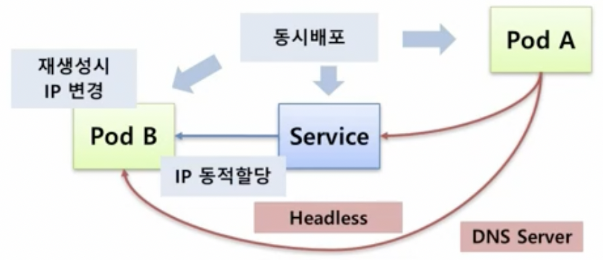
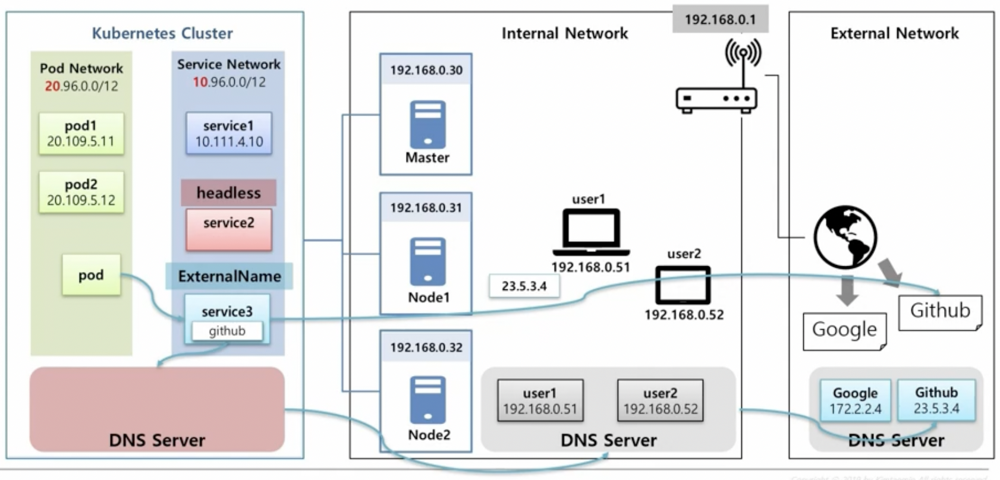

# Basic Object

## Service - Headless, Endpoint, ExternalName

- 기존에 봤던 `Service`에 대해 다시 보자.  
  아래 그림처럼 192.168로 시작하는 IP로 내부망이 형성되고, 그 안에 Master와 2개의 Worker `Node`들이 있다.  
  이들로 만들어진 K8S Cluster에는 `Pod`를 위한 IP 대역과 `Service`를 위한 IP 대역이 있다.  
  `Pod`는 20, `Service`는 10으로 시작하는데, 이 대역은 K8S를 구성할 때 설정할 수 있는 부분이다.  
  pod1, pod2 `Pod`가 있으며, 이 둘은 모두 service1이라는 `Service`에 연결되어 있다.  
  이때, `Service`가 `ClusterIP`라면 service1으로의 접근은 이 K8S를 구성하고 있는 서버들(3개의 `Node`들)에서만  
  가능하다. 오로지 이 서버들에 접근할 수 있는 권한이 있는 사람만 `ClusterIP`에 접근할 수 있기 때문에, 특정 `Pod`에  
  `ClusterIP`를 달았다는 뜻은 결국 내부 관리자만 접근할 수 있게 하기 위함인 것이다.  
  내부망 내에 IP를 할당받은 여러 기기들이 있을 수 있지만, 여기서는 직접 `Service`의 IP를 호출할 수 없다.  
  내부망에 있는 다른 기기들이 접근하기 위해서는 `NodePort` 유형의 `Service`를 만들어 각각의 서버가 30000번대  
  포트번호를 할당받고, 그 할당받은 포트를 사용해 `Service`와 연결해야 한다. 그래서 K8S 관리자는 내부망에 있는 사람들에게  
  이 서버들 중 하나의 IP와 포트번호를 알려주면 이를 통해 `Service`에 접근할 수 있다.

- AWS, GCP, Azure 등의 Cloud Provider를 사용해 K8S Cluster를 구축했을 때에는 `LoadBalancer` 타입의 서비스를  
  만들면 `NodePort`가 생성되면서 해당 포트에 `LoadBalancer`가 연결되고, 외부망에 있는 사람들은 이 IP를 통해서  
  `Service`에 연결할 수 있다.

- 즉 사용자 관점에서는 이들이 K8S 망에 있는 `Service`에, 궁극적으로는 연결되어 있는 `Pod`에 접근하기 위해  
  `ClusterIP`, `NodePort`, `LoadBalancer` 타입의 `Service`를 만들었던 것이다.

- 이번에는 사용자 입장이 아닌 `Pod`의 입장에서 원하는 `Service`, 혹은 다른 `Pod`로 직접 연결하는 방법과  
  외부 서비스에 안정적으로 연결하는 방법을 보자.

- 사용자 접근의 경우, `Service`가 만들어진 후에 해당 `Service`의 IP를 확인하고 해당 IP로 접근하면 되는데
  `Pod`의 경우에 자원들이 동시에 생성될 수 있다. 아래처럼 PodA가 PodB에 접근해야 하는 상황인데, IP는  
  `Pod`나 `Service`가 생성될 때 동적으로 할당되기 때문에 PodA는 PodB의 IP를 미리 알 수 없으며  
  PodB가 장애가 생겨 재생성되면 IP 또한 함께 변경되기 때문에 PodA가 PodB의 IP를 알고 있더라도 계속 쓸 수 없다.  
  이와 같은 문제를 해결해 PodA가 PodB와 `Service`에 연결할 수 있게 하기 위해서는 `DNS Server`와  
  `Headless Service`가 필요하다.

- 또한 `Pod`가 외부의 특정 사이트에 접근해서 데이터를 가져와야 하는 상황에서 접근 주소를 변경해야 하는 상황이 생기면  
  주소만 변경하기 위해 주소 변경 후 `Pod`를 재배포하지 않고 싶을 것이다. 이런 문제를 편리하게 해결하기 위해 K8S는  
  `Service`에 `ExternalName`을 이용해 외부로의 연결을 `Pod`의 수정 없이 변경하도록 할 수 있게 해준다.

- 위에서 본 사진의 K8S Cluster 부분에서 Pod Network와 Service Network외에 DNS Server도 존재한다.  
  DNS Server에는 `Service`의 도메인 이름과 IP가 저장되어 있기에 `Pod`가 service1에 대한 IP를 질의하면  
  해당 `Service`의 IP를 알려주는 역할을 한다. 또한 내부망에도 DNS Server가 구축되어 있다면, 내부 서버들이  
  생겼을 때 해당 서버의 이름들을 내부망의 DNS Server에 등록할 수 있고, 만약 `Pod`가 user1을 찾았을 때  
  K8S내의 DNS Server에 없다면 DNS 메커니즘 상 상위 DNS인 내부망의 DNS Server에 질의하게 되고, 발견하게 되면  
  해당 이름을 가진 서버의 IP를 알려준다. 마찬가지로 외부에 있는 사이트도 도메인명이 외부의 DNS Server에  
  등록되어 있기 때문에 예를 들어 Google을 찾으면 부모의 부모(외부의 DNS Server)에 질의하여 IP를 알 수 있다.

- 위처럼 `Pod`에서 DNS Server를 이용해서 원하는 `Service`나 외부 등에 접근할 수 있다. 그래서 `Pod`가 IP 주소를  
  몰라도 DNS에 서비스명으로 IP를 질의해 연결할 수 있는 것이다.

- 이번에는 하나의 `Pod`(Pod1)이 다른 `Pod`(Pod2)에 연결하고 싶다 해보자. 이 경우에는 `Pod`에 `Headless Service`를  
  연결하게 되면 DNS Server에 `Pod`명과 `Service`명이 붙여져 도메인이름으로 등록되기 때문에(ex. pod2.service2)  
  Pod1의 입장에서는 Pod2에 접근하기 위해서는 Pod2의 IP 주소는 불필요하고, 단지 DNS Server에 pod2.service2를 질의하면 된다.

- `ExternalName Service`를 사용하는 경우를 보자. 이 `Service`에는 특정 외부 도메인의 주소를 넣을 수 있다.  
  예를 들어 기존에 google.com이 있었다고 해보자. 이 경우 DNS Server를 타고 타서 부모의 부모 DNS Server(외부 DNS)에  
  질의하게 되어 해당 도메인의 IP를 알 수 있다. `Pod`가 `ExternalName Service`를 통해 데이터를 가져오도록 해놓았다면  
  추후 다른 곳에서 데이터를 갖고오도록 해야 한다면 `ExternalName Service`의 도메인 주소만 바꿔주면 된다.

- 이제 본격적으로 각각의 특징에 대해 살펴보자.

### Headless

- default라는 이름의 `Namespace`에 `Pod` 2개(pod1, pod2)가 `Service`(service1)에 연결되어 있다 해보자.  
  service1은 `ClusterIP`로 만든 `Service`이다.

- 그리고 K8S DNS가 있는데, 이 DNS의 이름은 cluster.local 이다. 이 DNS에는 `Pod`든 `Service`든 생성을 하면  
  아래처럼 긴 도메인 이름과 IP가 저장된다.

| 종류      | 도메인 이름                           | IP          |
| --------- | ------------------------------------- | ----------- |
| `Service` | service1.default.svc.cluster.local    | 10.11.4.10  |
| `Pod`     | 20-109-5-11.default.pod.cluster.local | 20.109.5.11 |

- 위에서 도메인 이름의 구조를 살펴볼 필요가 있는데, `Service`의 경우 도메인명이 `서비스명.namespace명.svc.DNS명`이 된다.  
  `Pod`의 경우에는 `IP.namespace명.pod.DNS명`의 형식을 갖는다. 이렇게 규칙을 갖고 만들어진 도메인 명을  
  FQDN(Fully Qualitifed Domain Name)이라 한다. 같은 namespace 안에서 `Service`는 도메인명을 사용할 때 Service명만  
  사용해도 되지만, `Pod`는 FQDN 전체를 명시해야 한다. 이 규칙 때문에 하나의 `Pod`가 다른 `Pod`에 접근하려면 FQDN을 모두  
  명시해야 하는데, `Pod`의 FQDN 형식에는 IP 주소가 포함되어 있기에 사용할 수 없다.

- `Pod` 입장에서는 `Service`의 이름을 DNS에 질의해 해당 `Service`의 IP를 가져올 수 있기에 접근하고 싶은 `Service`의  
  이름만 알아도 `Pod`에서 해당 `Service`에 접근할 수 있게 할 수 있으며, 모든 이름은 사용자가 직접 만들기 때문에 미리  
  `Service`의 이름을 생각해 놓고 `Pod`에 심어놓을 수 있다. 그래서 단순히 `Pod`에서 `Service`에만 연결하는 데는  
  `ClusterIP`로 서비스를 만들어도 문제가 없다.

- 그런데 똑같은 상황에서 `Pod`가 Pod4에 직접 연결하고 싶다면 `Service`를 `Headless Service`로 만들어야 한다.  
  `Headless Service`를 만드는 방법은 clusterIP 속성에 None을 지정하기만 하면 되며, 이는 이 `Service`의 IP를  
  만들지 않겠다는 의미로, 실제로 만들어지지 않는다.

- 또한 `Pod`를 만들 때도 hostname 속성에 도메인 이름을, 그리고 subdomain 속성에는 위에서 만든 `Headless Service`의 이름을  
  지정해줘야 한다. 이렇게 만들면 DNS에 `Service`는 도메인 명은 기존과 그대로 등록되지만 IP를 갖지 않기에 서비스명을 질의하면
  연결되어 있는 모든 `Pod`들의 IP를 돌려준다 `Pod`는 `hostname.subdomain.namespace명.svc.cluster.local`로 등록된다.

### Endpoint

- 기본적으로 `Service`와 `Pod`를 연결할 때 `Label`을 통해 연결한다. 그런데 `Label`은 사용자 측면에서 `Service`를 통해  
  `Pod`로 연결하기 위한 도구일 뿐이지, K8S는 `Endpoint`라는 것을 만들어줘서 실제 `Service`와 `Pod` 사이의 연결고리를  
  관리한다.

- K8S는 `Service`명과 동일한 이름으로 `Endpoint`의 이름을 설정하고, `Endpoint` 내에는 `Pod`에 접근하기 위한 정보들이  
  들어있다. 그렇기에 이 `Endpoint` 내에 만들어지는 정보들의 규칙을 알면 `Label`과 `Selector`를 만들지 않고 직접  
  연결할 수 있게 된다.

- 우선 `Service`와 `Pod`를 만들 때, 둘 다 `Label`이 없다면 이 둘은 일단 연결되지 않을 것이다.  
  이 상태에서 `Service`이름으로 `Endpoint`를 만들고, `Pod`의 정보를 직접 `Endpoint`에 넣게 되면 연결이 된다.  
  `Service`의 연결 대상을 사용자가 직접 지정해준 것인데, IP와 Port가 내부를 가리킬 수도 있고, 외부 IP 주소를 안다면  
  외부를 가리킬 수도 있다.

- 하지만 우리가 도메인명를 사용하는 이유는 IP의 변경 가능성 때문이다.  
  따라서 도메인이름을 지정하는 방법도 필요한데, 이때 사용하는 것이 `ExternalName`이다.

### ExternalName

- `Service`에 externalName이라는 속성을 달아, 이 안에 도메인 이름을 넣을 수 있는데, 이렇게 지정해주면  
  DNS Cache가 내부와 외부의 DNS를 찾아 IP를 알아낸다.

- 따라서 `Pod`가 externalName이 있는 `Service`를 가리키고만 있으면 `Service`에서 필요할 때마다  
  도메인명을 변경할 수 있어서 접속할 외부 도메인이 변경되더라도 `Pod`를 재생성 또는 재배포할 필요가 없다.
