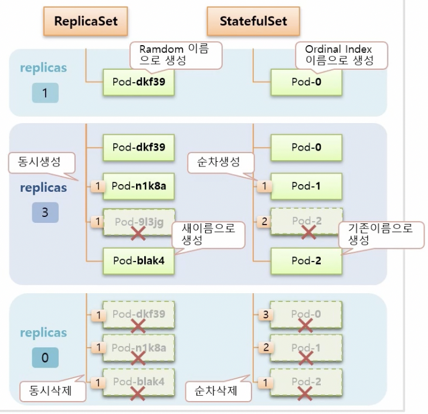

# Controllers

## StatefulSet

- 애플리케이션은 대표적으로 Stateless Application과 Stateful Application으로 분류된다.

- Stateless Application

  - 대표적으로 Web Server가 있으며 Apahe, NginX 등이 있다.
  - 애플리케이션이 여러 개 배포되어도 다 똑같은 서비스 역할을 한다.

- Stateful Application

  - 대표적으로 Database가 있으며, MariaDB, Redis, MongoDB 등이 있다.
  - 각각의 애플리케이션마다 자신의 역할이 있다. MongoDB를 예로 들자면 Primary, Secondary, Arbiter 역할이 있는데  
    Primary는 Main Database의 역할을 하며 Primary가 죽으면 Arbiter가 이를 감지해 Secondary가 Primary의  
    역할을 대신할 수 있도록 해준다.

- 위처럼 단순 복제인 Stateless Application과 달리, Stateful Application은 각 애플리케이션 마다  
  자신의 고유 역할을 갖고 있다. 그래서 만약 애플리케이션 중 하나가 다운되면, Statelss Application은  
  단순히 같은 서비스의 역할을 하는 애플리케이션을 복제해주면 되고, Stateful Application의 경우 위에서 본  
  Arbiter역할을 하는 애플리케이션이 죽으면 반드시 Abriter역할을 하는 애플리케이션을 다시 생성해줘야 한다.

- 또 다른 차이점으로 Statelss Application은 `Volume`이 반드시 필요하지는 않다. 만약 애플리케이션의 로그를 영구적으로  
  저장하고 싶은 경우, `Volume`에 연결하면 된다. 반면 Stateful Application은 각각의 역할이 다른 만큼, `Volume` 또한  
  각각 써야 한다. 그래샤 Arbiter 역할의 애플리케이션이 죽어도, 새로운 애플리케이션이 기존 Arbiter가 연결되어 있던  
  `Volume`과 연결되면서 해당 역할을 이어갈 수 있다.

- 또한 애플리케이션이 연결되는 대상과 네트워킹 흐름에 대한 차이점도 있다. Stateless Application은 대체로 사용자들이 접속하며,  
  로드밸런서 등에 의해 여러 애플리케이션으로 트래픽이 분산된다. 반면 Stateful Application은 대체로 내부 시스템들이 데이터베이스  
  저장을 위해 연결하며 이때 트래픽은 각 애플리케이션의 특징에 맞게 분류되어야 한다. 예를 들어 Primary는 Read/Write의 권한이  
  있기 때문에 연결하려는 시스템에서 CRUD 연산을 모두 하려면 Primary에 접속해야 하며 Secondary는 Read의 권한만 있기 때문에  
  READ 연산만 하는 시스템은 트래픽 분산을 위해 Secondary로 접속되어야 한다. 마지막으로 Arbiter는 Primary와 Secondary의  
  상태를 감시하고 있어야하기 때문에 Primary와 Secondary에 연결되어야 한다.  
  이렇게 Stateful Application은 역할에 따라 의도적으로 다른 애플리케이션에 연결되며 Stateless Application은 단순 분산의  
  목적만을 가진다.

- K8S에는 이러한 두 애플리케이션의 특징에 따라 각각 `Controller`를 제공하는데, Stateless Application은  
  `ReplicaSet`, Stateful Application은 `StatefulSet`을 제공한다.

- `StatefulSet`은 Stateful Application을 관리할 수 있도록 지원한다. 목적에 따라 적절한 `Pod`에 연결하기 위해  
  `Pod`에 `Headless Service`를 달아주면 된다.

## StatefulSet과 ReplicaSet의 Controller 관점에서의 차이

- `StatefulSet`은 `Controller` 이며, 이 `Controller`의 특징을 `ReplicaSet`과 비교해가며 알아보자.

- 먼저 `replicas:1`로 `Controller`를 만들면, `ReplicaSet`과 마찬가지로 `StatefulSet`도 1개의 `Pod`를 생성한다.  
  이때 차이점은 `ReplicaSet`은 `Pod`의 이름이 random하게 부여되는 반면, `StatefulSet`은 0부터 순차적으로 Ordinal Index가  
  부여된 이름으로 생성된다.

- 만약 `replicas:3`으로 개수를 늘려보면 어떻게 될까? `ReplicaSet`은 두 개의 추가적인 `Pod`가 동시에 생성되고, 이름 또한  
  random하게 부여되는 것에 반해 `StatefulSet`의 경우에는 `Pod`가 하나씩 순차적으로 생성된다. 이름 또한 1, 2가 부여된다.  
  이 상황에서 하나의 `Pod`가 죽으면, `ReplicaSet`은 또 새로운 임의의 이름을 가진 `Pod`가 생성되는 반면, `StatefulSet`은  
  죽은 `Pod`의 이름 그대로를 가진 새로운 `Pod`를 만든다.

- 기존에 `replicas:3`으로 3개의 `Pod`가 있는 상태에서 `replicas:0`으로 개수를 줄이면 `ReplicaSet`은 모든 기존의 `Pod`가  
  동시에 삭제되는 반면, `StatefulSet`은 index가 높은 `Pod`부터 순차적으로 삭제한다.

