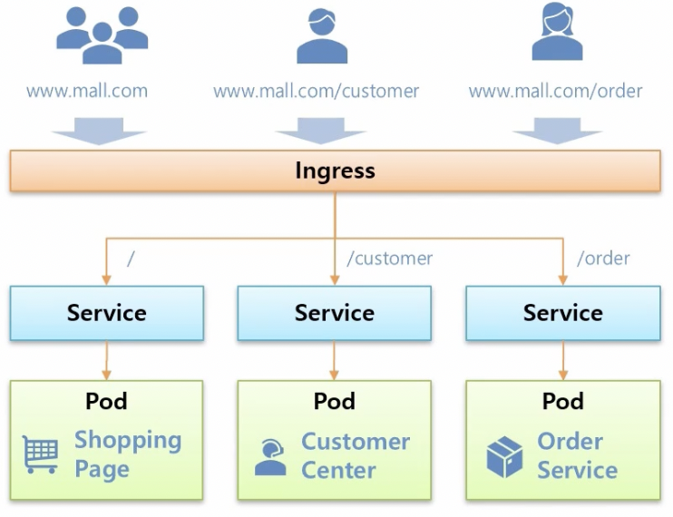

# Controllers

## StatefulSet

- 애플리케이션은 대표적으로 Stateless Application과 Stateful Application으로 분류된다.

- Stateless Application

  - 대표적으로 Web Server가 있으며 Apahe, NginX 등이 있다.
  - 애플리케이션이 여러 개 배포되어도 다 똑같은 서비스 역할을 한다.

- Stateful Application

  - 대표적으로 Database가 있으며, MariaDB, Redis, MongoDB 등이 있다.
  - 각각의 애플리케이션마다 자신의 역할이 있다. MongoDB를 예로 들자면 Primary, Secondary, Arbiter 역할이 있는데  
    Primary는 Main Database의 역할을 하며 Primary가 죽으면 Arbiter가 이를 감지해 Secondary가 Primary의  
    역할을 대신할 수 있도록 해준다.

- 위처럼 단순 복제인 Stateless Application과 달리, Stateful Application은 각 애플리케이션 마다  
  자신의 고유 역할을 갖고 있다. 그래서 만약 애플리케이션 중 하나가 다운되면, Statelss Application은  
  단순히 같은 서비스의 역할을 하는 애플리케이션을 복제해주면 되고, Stateful Application의 경우 위에서 본  
  Arbiter역할을 하는 애플리케이션이 죽으면 반드시 Abriter역할을 하는 애플리케이션을 다시 생성해줘야 한다.

- 또 다른 차이점으로 Statelss Application은 `Volume`이 반드시 필요하지는 않다. 만약 애플리케이션의 로그를 영구적으로  
  저장하고 싶은 경우, `Volume`에 연결하면 된다. 반면 Stateful Application은 각각의 역할이 다른 만큼, `Volume` 또한  
  각각 써야 한다. 그래샤 Arbiter 역할의 애플리케이션이 죽어도, 새로운 애플리케이션이 기존 Arbiter가 연결되어 있던  
  `Volume`과 연결되면서 해당 역할을 이어갈 수 있다.

- 또한 애플리케이션이 연결되는 대상과 네트워킹 흐름에 대한 차이점도 있다. Stateless Application은 대체로 사용자들이 접속하며,  
  로드밸런서 등에 의해 여러 애플리케이션으로 트래픽이 분산된다. 반면 Stateful Application은 대체로 내부 시스템들이 데이터베이스  
  저장을 위해 연결하며 이때 트래픽은 각 애플리케이션의 특징에 맞게 분류되어야 한다. 예를 들어 Primary는 Read/Write의 권한이  
  있기 때문에 연결하려는 시스템에서 CRUD 연산을 모두 하려면 Primary에 접속해야 하며 Secondary는 Read의 권한만 있기 때문에  
  READ 연산만 하는 시스템은 트래픽 분산을 위해 Secondary로 접속되어야 한다. 마지막으로 Arbiter는 Primary와 Secondary의  
  상태를 감시하고 있어야하기 때문에 Primary와 Secondary에 연결되어야 한다.  
  이렇게 Stateful Application은 역할에 따라 의도적으로 다른 애플리케이션에 연결되며 Stateless Application은 단순 분산의  
  목적만을 가진다.

- K8S에는 이러한 두 애플리케이션의 특징에 따라 각각 `Controller`를 제공하는데, Stateless Application은  
  `ReplicaSet`, Stateful Application은 `StatefulSet`을 제공한다.

- `StatefulSet`은 Stateful Application을 관리할 수 있도록 지원한다. 목적에 따라 적절한 `Pod`에 연결하기 위해  
  `Pod`에 `Headless Service`를 달아주면 된다.

### StatefulSet과 ReplicaSet의 Controller 관점에서의 차이

- `StatefulSet`은 `Controller` 이며, 이 `Controller`의 특징을 `ReplicaSet`과 비교해가며 알아보자.

- 먼저 `replicas:1`로 `Controller`를 만들면, `ReplicaSet`과 마찬가지로 `StatefulSet`도 1개의 `Pod`를 생성한다.  
  이때 차이점은 `ReplicaSet`은 `Pod`의 이름이 random하게 부여되는 반면, `StatefulSet`은 0부터 순차적으로 Ordinal Index가  
  부여된 이름으로 생성된다.

- 만약 `replicas:3`으로 개수를 늘려보면 어떻게 될까? `ReplicaSet`은 두 개의 추가적인 `Pod`가 동시에 생성되고, 이름 또한  
  random하게 부여되는 것에 반해 `StatefulSet`의 경우에는 `Pod`가 하나씩 순차적으로 생성된다. 이름 또한 1, 2가 부여된다.  
  이 상황에서 하나의 `Pod`가 죽으면, `ReplicaSet`은 또 새로운 임의의 이름을 가진 `Pod`가 생성되는 반면, `StatefulSet`은  
  죽은 `Pod`의 이름 그대로를 가진 새로운 `Pod`를 만든다.

- 기존에 `replicas:3`으로 3개의 `Pod`가 있는 상태에서 `replicas:0`으로 개수를 줄이면 `ReplicaSet`은 모든 기존의 `Pod`가  
  동시에 삭제되는 반면, `StatefulSet`은 index가 높은 `Pod`부터 순차적으로 삭제한다.

### Stateful과 ReplicaSet의 PVC, Headless Service를 연결하는 부분의 차이

- `ReplicaSet`의 경우에는 `Pod`에 `Volume`을 연결하기 위해서 `PVC`를 별도로 직접 생성해야 한다.  
  예를 들어 PVC1이라는 `PVC`를 만들었다면, `ReplicaSet`의 template에 `Pod`의 내용에 persistentVolumeClaim  
  속성에 PVC1을 지정해줘야 한다. 반면 `StatefulSet`의 경우에는 template을 통해 `Pod`가 만들어지고 추가적으로  
  volumeClaimTemplates가 있는데, 이를 통해 `PVC`를 동적으로 생성되고, `Pod`와도 바로 연결되게끔 한다.

- `replicas:3`으로 개수를 늘리면 `ReplicaSet`은 모든 `Pod`들이 동일한 `PVC`(PVC1)을 통해 `PV`와 연결되는 반면,  
  `StatefulSet`은 volumeClaimTemplates 때문에 `Pod`가 추가될 때마다 각각 동적으로 생성된 새로운 `PVC`에 연결된다.  
  그래서 `Pod`마다 각자의 역할에 따른 데이터를 저장할 수 있게 되는 것이다. 만약 Pod2가 삭제되면, 기존 Pod2가 연결되었던  
  `PVC`에 연결이 된다.

- 한 가지 주의할 점이 있는데, `ReplicaSet`의 경우에 만약 `PVC`가 Node1이라는 `Node`에 만들어졌다면, 해당 `PVC`에  
  연결하는 `Pod`도 항상 Node1 상에 만들어져 있어야 한다. 반면, `StatefulSet`의 경우에는 동적으로 `Pod`과 `PVC`가  
  동일한 `Node`상에 만들어지기 때문에 알아서 모든 `Node`에 균등하게 배포된다.

- 또한 `replicas:0`으로 모든 `Pod`를 지우려 하면 `StatefulSet`은 `Pod`를 index가 높은 순서부터 순차적으로  
  하나씩 삭제하지만, `PVC`는 삭제하지 않는다. `Volume`은 함부로 지우면 안되기 때문에 삭제하기 위해선 사용자가 직접  
  삭제해야 한다.

- 마지막으로 `StatefulSet`을 만들 때 serviceName 속성에 `Service`의 이름을 지정할 수 있는데, 만약 이 이름과 맞는  
  `Headless Service`를 만들게 되면 `Pod`에 예측 가능한 도메인 이름이 만들어지기 때문에 Internal Server에 있는  
  특정 `Pod`가 `StatefulSet`이 관리하는 특정 `Pod`에 연결할 수 있다. 따라서 상황에 따라 `Pod`를 선택해 접속할 수  
  있게 되는 것이다.

## Ingress - Nginx

- `Ingress`의 사용 목적으로는 대표적으로 Service Loadbalancing과 Canary Upgrade가 있다.

### Ingress Use Case - Service Loadbalancing

- 쇼핑몰을 운영 중이라 가정해보자. 3개의 `Pod`가 있고, 각각 쇼핑 페이지, 고객 센터, 배송 서비스를 담당한다.  
  이렇게 애플리케이션을 분리하면 쇼핑 페이지에 문제가 생겨도 고객 센터나 배송 서비스를 제공하는 데에는 아무런  
  문제가 생기지 않도록 할 수 있다. 또한 이 3개의 `Pod`에는 외부에서 연결할 수 있도록 각각 `Service`가 있다.  
  사용자들은 쇼핑 페이지에는 `www.mall.com`, 고객 센터에는 `www.mall.com/customer`, 그리고 배송 서비스로는  
  `www.mall.com/order`로 접근할 수 있다.

- 위와 같은 상황을 만들고 싶다면, 일반적으로는 각각의 path에 따라 각 `Service`의 IP를 이어줄 수 있는  
  L4 또는 L7 Switch 장비가 있어야 한다. 하지만 K8S에서는 `Ingress`라는 Object가 그 역할을 대신해준다.

- `Ingress`를 사용하면 별도의 IP loadbalancing을 위한 장비가 필요없게 된다.

### Ingress Use Case - Canary Upgrade

- `Ingress`를 사용하면 Canary Upgrade 또한 쉽게 진행할 수 있다.

- 예르 들어 V1 애플리케이션이 구동되는 상태에서 테스트를 위해 V2를 구동시킨다고 해보자.  
  V1, V2는 각각 다른 `Service`에 연결되어 있는데 이 상황에서 `Ingress`를 만들어 이 두 개의 `Service`에 연결하면  
  사용자가 `Ingress`를 통해 접근했을 때 예를 들어 10%의 트래픽만 V2로 전달되도록 할 수 있다. 이 퍼센트 수치를 변경하거나,  
  연결 시 헤더에 있는 정보로 트래픽을 조정할 수도 있다.

