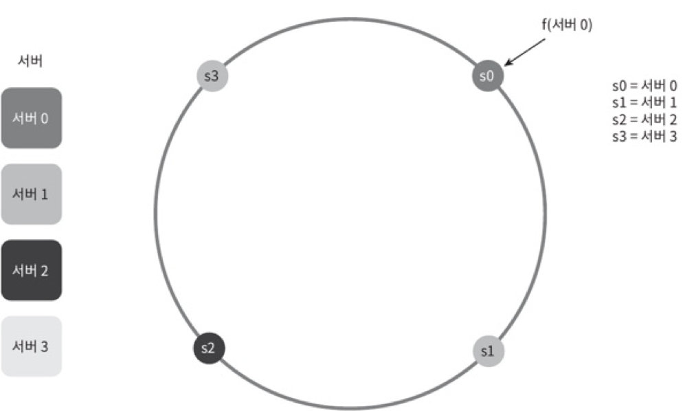
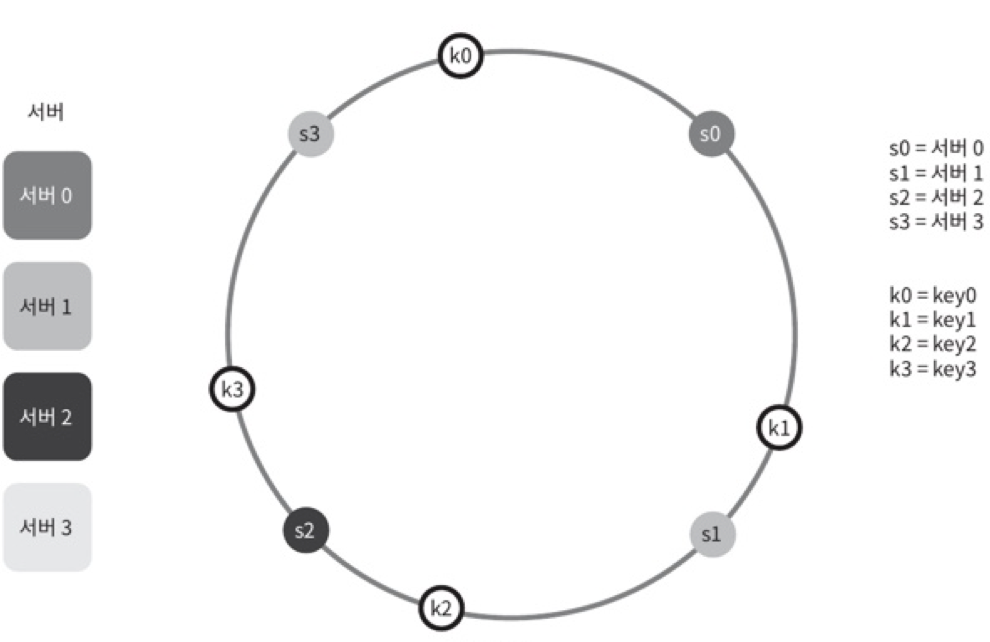
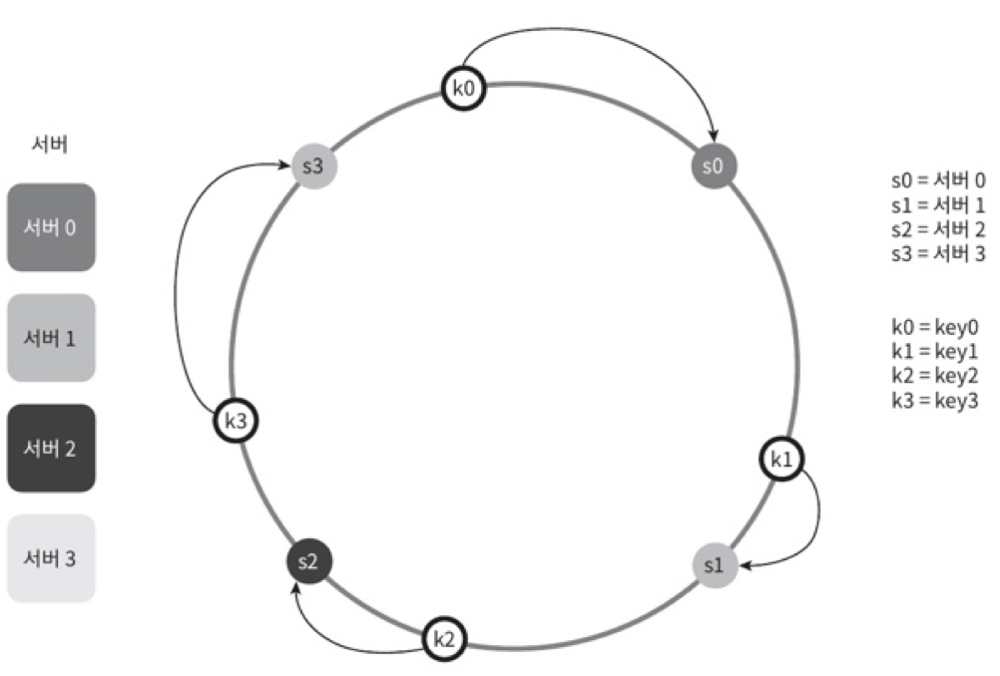
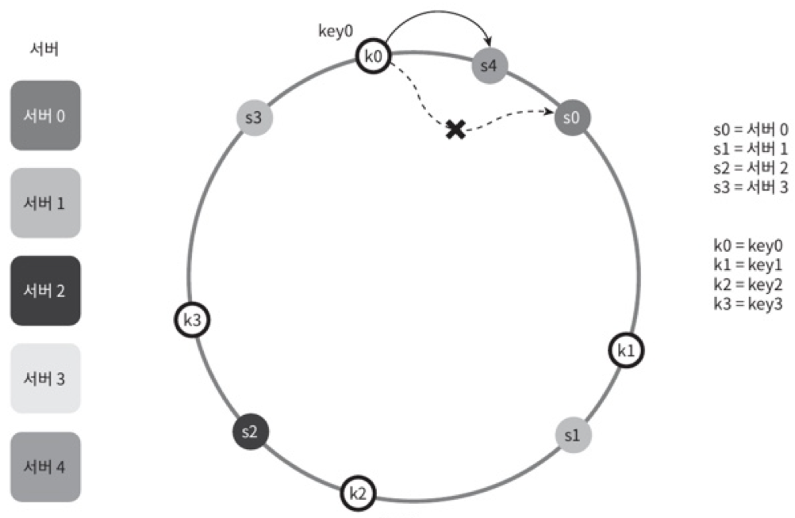
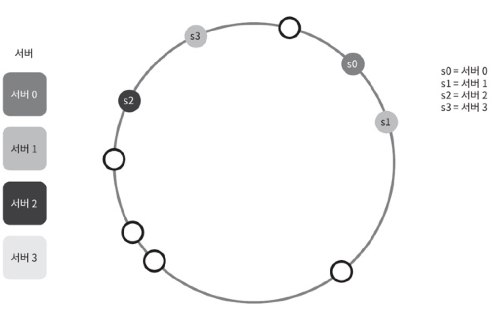
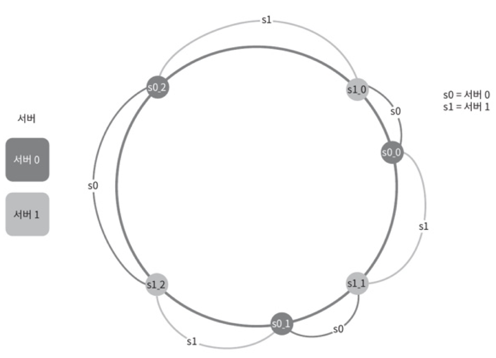
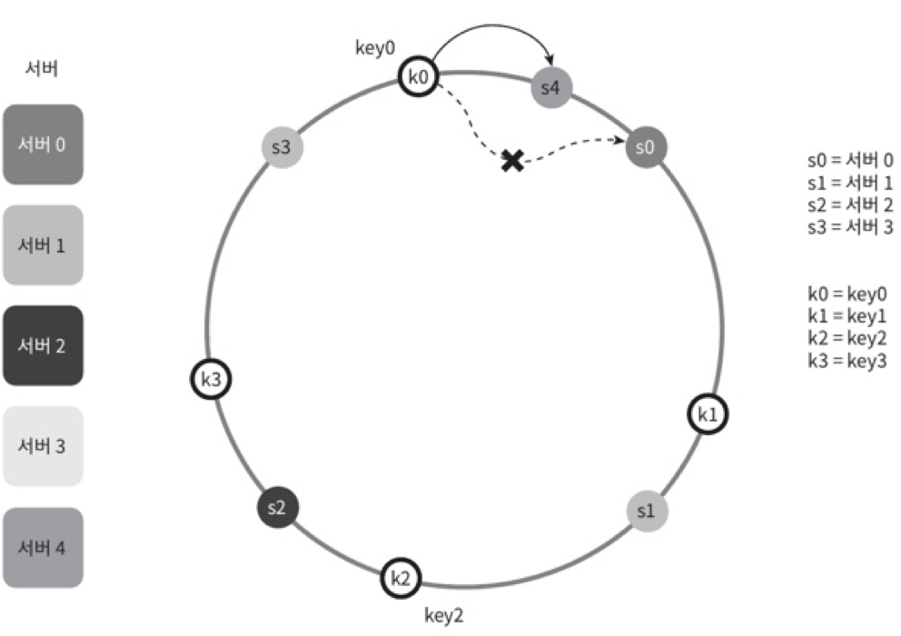
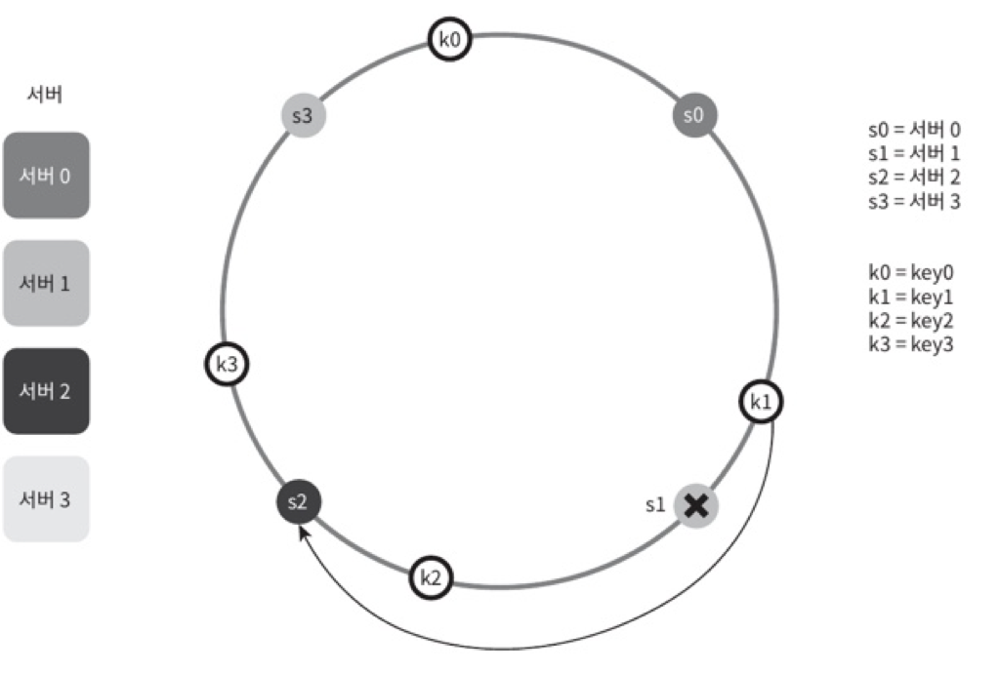

# Consistent Hashing(안정 해시) 설계

- 수평적 규모 확장성을 달성하기 위해서는 요청 또는 데이터를 서버에 균등하게 나누는 것이 중요하다.  
  이를 달성하기 위해서는 보편적으로 **안정 해시**를 사용한다.

## Consistent Hashing이 풀어주는 기술적 문제들

### Hash Key Rehash(재배치) 문제

- N개의 캐시 서버가 있다고 해보자. 이 서버들에 부하를 균등하게 나누는 보편적인 방법은 아래의 해시 함수를 사용하는 것이다.

```c
serverIndex = hash(key) % N // N: Server 개수
```

- 예시로 4개의 서버를 사용한다 해보자. 아래는 실제 상황에 대한 예시 표이다.

| Key  | Hash     | Hash % 4 (Server Index) |
| ---- | -------- | ----------------------- |
| key0 | 18358617 | 1                       |
| key1 | 26143584 | 0                       |
| key2 | 18131146 | 2                       |
| key3 | 35864496 | 0                       |
| key4 | 34085809 | 1                       |
| key5 | 27581703 | 3                       |
| key6 | 38164978 | 2                       |
| key7 | 22530351 | 3                       |

- 표에서 알 수 있듯이, 특정 Key가 보관된 서버를 알아내기 위해 modular 연산을 적용했다.

- 위 방법은 Server Pod의 크기가 고정되어 있을 때, 그리고 데이터 분포가 균등할 때는 잘 동작하지만 서버가 추가되거나  
  기존 서버가 삭제되면 문제가 생긴다. 예를 들어 1번 서버가 죽으면 서버 크기는 3으로 변하기에 modular 연산의 결과가  
  전과 달라질 것이다. 이렇게 되면 클라이언트는 실제 데이터가 없는 엉뚱한 서버로 접근하게 된다.  
  이 문제를 효과적으로 해결해주는 기술이 바로 **안정 해시**이다.

### Consistent Hashing

- Consistent Hashing의 Wikipedia 정의는 아래와 같다.

> Consistent Hashing(안정 해시): 해시 테이블 크기가 조정될 때 평균적으로 오직 k/n개의 key만 재배치하는 해시 기술.  
> (k: key 개수, n: slot 개수)

#### Hash Space와 Hash Ring

- Consistent Hashing의 동작 원리를 살펴보자. 해시 함수로는 SHA-1을 사용한다 하고, 그 함수의 출력 값 범위는 x0, x1, x2, ..  
  xn과 같다고 하자. SHA-1의 Hash Space 범위는 0부터 2^160-1 까지라고 알려져 있다.  
  따라서 x0는 0, xn은 2^160-1이며 나머지 x1부터 xn-1까지는 그 사이의 값을 갖게 될 것이다.  
  이를 하나의 일직선 으로 나타낼 수 있는데, 이 일직선의 양 끝을 구부려 접은 것을 Hash Ring이라 한다.

#### Hash Server

- 이 해시 함수를 `f`라 하자. `f`를 사용하면 서버 IP나 이름을 Hash Ring의 특정 위치에 위치시킬 수 있다.



#### Hash Key

- 캐시할 Key들을 생각해보자. 이 Key들은 _Hash Key Rehash 문제_ 에서 쓴 modular 연산을 사용하지 않기에,  
  Hash Ring 위의 어느 지점에 배치할 수 있다.



#### 서버 조회

- 특정 key가 저장되는 서버는 해당 key의 시계 방향으로 Hash Ring을 탐색해가면서 만나는 첫 번째 서버이다.  
  예를 들어, 아래 그림에 따라 key2는 s2, key3은 s3에 저장된다.



#### 서버가 추가되는 경우

- 위에서 본 안정 해시의 정의에 따르면, 서버가 추가되어도 key 중 일부만 재배치할 수 있게 된다.



- 위 그림을 보면 새로운 서버인 s4가 추가되었음을 확인할 수 있다. 하지만 재배치된 key는 k0 뿐이다. 자세히 보자.  
  s4가 추가되기 전, k0는 s0에 저장되어 있었다. 하지만 s4가 추가된 뒤에 k0는 s4에 저장되는데, 그 이유는  
  k0의 위치에서 시계 방향으로 순회했을 때 처음으로 만나게 되는 서버가 s4이기 때문이다.  
  다른 Key들은 재배치되지 않는다.

#### 서버가 제거되는 경우

- 서버가 제거되더라도 추가될 때와 마찬가지로 key 가운데 일부만 재배치된다. 아래 그림을 보면, s1이 삭제되었을 때  
  오직 k1만이 s2로 재배치되었음을 알 수 있다. 마찬가지로 제거된 후에 k1의 위치에서 시계 방향으로 순회했을 때  
  처음으로 만나는 서버가 s2이기 때문이다. 다른 key들에는 영향이 없다.


### Consistent Hashing 기본 구현법의 두 가지 문제

- Consistent Hashing 알고리즘은 MIT에서 처음 제안되었으며, 기본 절차는 아래와 같다.

  - Server와 Key를 균등 분포(Uniform Distribution) Hash Function을 사용해 Hash Ring에 배치한다.
  - Key의 위치에서 Hash Ring을 시계 방향으로 탐색하다 만나는 최초의 서버가 key가 저장될 서버이다.

- 위 접근법에는 두 가지 문제가 있다.  
  우선 서버가 추가되거나 삭제되는 상황을 감안하면, partition의 크기를 균등하게 유지하는 것이 불가능하다.  
  여기서 말하는 partition이란 인접한 서버 사이의 hash space이다. 즉, 어떤 서버는 굉장히 작은 hash space를  
  할당 받고, 어떤 서버는 굉장히 큰 hash space를 할당받는 상황이 발생할 수 있다는 것이다.  
  아래 그림을 보면, s1이 삭제되는 바람에 s2의 partition이 다른 partition 대비 거의 2배로 커지게 되었다.


- 두 번째 문제는 key의 균등 분포(Uniform Distribution)을 달성하기가 어렵다는 점이다.  
  예를 들어 서버가 아래처럼 배치되어 있다고 해보자. s1, s3는 아무런 데이터도 갖지 않는 반면,  
  대부분의 key는 s2에 보관될 것이다.



### Virtual Node(가상 노드)

- 위에서 본 Consistent Hashing 기본 구현의 두 가지 문제점을 해결해주는 기술로는 **Virtual Node**가 있다.  
  Virtual Node는 실제 node 또는 서버를 가리키는 node로서, 하나의 서버는 Hash Ring 위에 여러 개의 virtual node를  
  가질 수 있다. 아래 그림을 보자. (3을 사용했지만, 실제 상황에서는 훨씬 큰 값이 사용된다.)



- 우선 s0(서버 0)을 Hash Ring에 배치하기 위해 기존처럼 s0 하나만 쓰는 대신, `s0_0`, `s0_1`, `s0_2`의 3개의  
  virtual node를 사용했다. 따라서 각 서버는 하나가 아닌, 여러 개의 partition을 관리해야 한다. 위 그림에서 s0으로  
  표시된 partition은 s0이 관리하는 partition이고, s1으로 표시된 partition은 s1이 관리하는 partition이다.

- 다음으로 아래 그림을 보자. 마찬가지로 key의 위치로부터 시계 방향으로 hash ring을 탐색하다 만나는 최초의 virtual node가  
  해당 key가 저장될 서버가 된다. 아래 그림에서 k0가 저장되는 서버는 k0의 위치로부터 hash ring을 시계 방향으로 탐색하다  
  만나는 최초의 virtual node인 `s1_1`이 된다. 즉, s1(서버 1)에 저장되는 것이다.

- Virtual Node의 개수를 늘리면 늘릴 수록 key의 분포는 점점 더 균등해진다. 표준 편차(Standard Deviation)가 작아져서 데이터가  
  고르게 분포되기 때문이다. 표준 편차는 데이터가 어떻게 퍼져 나갔는지를 보이는 척도다. 계산 결과 100~200개의 virtual node를  
  사용했을 경우, 표준 편차 값은 평균의 5%(virtual node가 200개인 경우)에서 10%(virtual node가 100개인 경우) 사이이다.  
  Virtual Node의 개수를 더 늘리면 표준 편차값도 더 떨어진다. 그러나 virtual node 데이터를 저장할 공간은 더 많이 필요하게 될 것이다.  
  즉, tradeoff가 필요하게 된다. 따라서 virtual node의 개수는 시스템의 요구사항에 맞도록 적절히 조정해야 한다.

#### Rehashing할 key 결정

- 서버가 추가되거나 제거되면 데이터 일부는 재배치되어야 한다. 어느 범위의 key들이 재배치되어야 하는지 알아보자.

- 아래 그림처럼 s4가 추가되었다고 해보자. 이에 영향 받은 범위는 s4(새로 추가된 node)부터 그 반시계 방향에 있는  
  첫 번째 서버인 s3까지이다. 즉, s3부터 s4 사이에 있는 key들을 s4로 재배치해야 한다.



- 서버가 삭제되는 경우도 보자. 아래 그림처럼 s1이 삭제되면 삭제된 node인 s1부터 그 반시계 방향에 있는 최초의 서버인  
  s0 사이에 있는 key들이 s2로 재배치되어야 한다.



---
