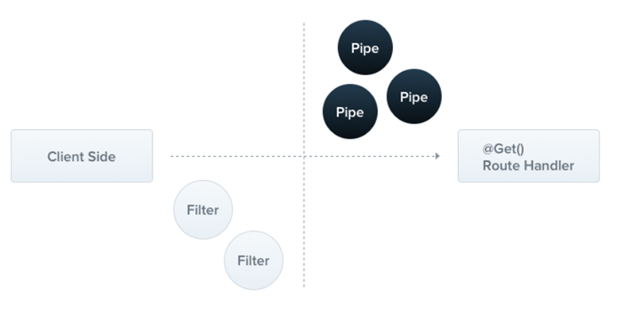

<h1>NestJS의 Pipes</h1>

* Pipe는 `@Injectable()` 어노테이션이 적용된 클래스이며,   
  Pipe는 무조건 `PipeTransform` 인터페이스를 구현해야 한다.

* Pipe는 보통 아래 두 경우에 사용된다.
  * `Transformation` : Input Data를 사용자가 원하는 타입으로 변환하고자 할 때   
    ex) string을 number로 변환
  * `Validation` : Input Data를 검증하여 올바르지 않으면 예외를 발생시킨다.

* 위의 두 경우 모두, Pipe는 `Controller Route Handler`로 전달되는 인자들에 대해   
  특정 작업을 실행한다. Nest는 pipe를 __해당 컨트롤러의 메소드가 실행되기 전에__   
  pipe를 작동시키며, pipe는 특정 작업을 수행한 후 컨트롤러의 메소드로 제어를 넘긴다.

* Nest는 기본적으로 Pipe들을 제공하며, 개발자는 본인이 원하는 Pipe를 만들어   
  사용할 수도 있다.

* 참고로 Pipe는 `Exceptions zone`에서 실행된다. 이는 곧 만약 Pipe가 작업을   
  수행하는 도중 예외를 발생시키면(Exception은 Exceptions Layer가 담당한다.)   
  해당 컨트롤러의 메소드는 실행되지 않는 다는 것을 의미한다.   
  이는 데이터를 검증하는데에 있어 매우 당연한 일이다.

