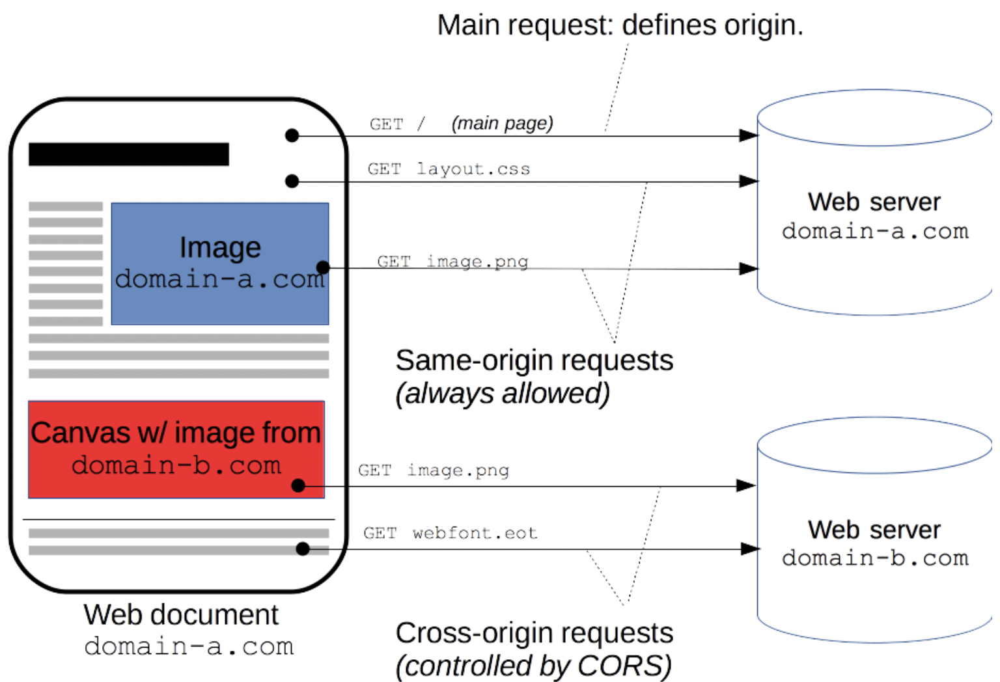

<h1>CORS에 대해서</h1>

- 이 글은 <a href="https://developer.mozilla.org/en-US/docs/Web/HTTP/CORS">문서</a> 를 한글로 번역하며 정리한 글 입니다.

<h2>CORS란?</h2>

- `CORS(Cross-Origin Resource Sharing)`는 HTTP-header에 기반을 둔 메커니즘으로, 서버로 하여금  
  브라우저가 허용하는 다른 origin(도메인, 스키마, 포트 등)을 표시할 수 있게 해준다.  
  CORS는 브라우저가 cross-origin resource를 호스팅하는 서버에게 `preflight request`를 보내서 서버가 해당 요청을  
  수락할지, 기각할지를 결정하는 메커니즘에도 기반한다. 이 `preflight request`에서 브라우저는 실제 요청에 사용될  
  HTTP Method와 헤더 정보를 포함한 헤더를 보낸다.

- Cross-Origin Request의 예시를 들어보자.  
  JavaScript로 작성된 프론트엔드 코드가 작동하는 `https://domain-a.com`에서 `XMLHttpRequest`를 사용하여  
  `https://domain-b.com/data.json` 파일에 HTTP 요청을 보낸다고 해보자.

- 보안 상의 문제로, 브라우저 차원에서 JS, TS와 같은 스크립트 언어에서 호출한 cross-origin 요청들은 막아진다.
  예를 들어, `XMLHttpRequest`와 `Fetch API`는 cross-origin policy가 아닌 same-origin policy를 따른다.  
  same-origin policy를 따른 다는 것은, `XMLHttpRequest`, `Fetch API`를 사용하는 웹 애플리케이션은  
  해당 애플리케이션이 로딩된 동일한 origin에 대해서만 리소스 요청을 보낼 수 있다는 것이다.  
  만약 요청이 CORS 헤더 정보를 담으면, CORS 요청도 가능해진다.

- 아래 그림은 same-origin과 cross-origin 요청에 대한 간략한 설명이다.

- CORS 메커니즘은 브라우저와 서버 사이의 cross-origin 요청과 데이터 송수신에 대한 보안을 지원한다.  
 최근, 거의 모든 브라우저들은 `XMLHttpRequest`, `Fetch`와 같은 API에서 CORS를 사용해 cross-origin HTTP 요청에 대한  
 위험성을 최소화 한다.

<h2>기능적 측면에서 본 CORS</h2>

- CORS는 요청을 보낸 브라우저가 리소스를 받아도 되는지에 대한 검증하는 정보를 담은 HTTP Header를 전송하여  
   서버로 하여금 허용 여부를 결정하도록 한다. 또한 추가적인 검증도 진행하는데, 순서는 아래와 같다.  
   (1) `GET` 요청 이외의 HTTP Method들, 특정 `MIME Type`을 포함한 `POST` 요청의 경우에 CORS Policy에 의해  
   서버는 브라우저가 `preflight request`를 보냈을 것이라고 생각한다.  
  (2-1) 만약 `preflight request`가 없다면 이 요청은 잘못된 것으로 판단하고, 요청을 거부한다.  
  (2-2) `preflight request`가 있다면 `HTTP OPTION` 요청 방식을 사용하여 허용되는 HTTP METHOD에 대한 정보를 받는다.  
  (2-3) 이후 서버에게 `승인(approval)`을 받으면, 그제서야 실제 요청이 보내진다.

- 추가적으로, 서버는 요청과 함께 보내져야 할 클라이언트에게 인증에 대한 정보(Credentials, 쿠키, HTTP Authentication 등)를 요구할 수 있다.

- CORS의 실패는 에러로 처리되는데, 보안적 문제로 에러에 대한 정확한 정보는 JavaScript에서 확인할 수 없다.  
 에러 코드로 확인할 수 있는 정보는 에러가 발생했다는 것 뿐이다. 정확히 무엇이 잘못되었는지에 대해서는 브라우저의  
 콘솔을 확인하는 방법 외에는 없다.

