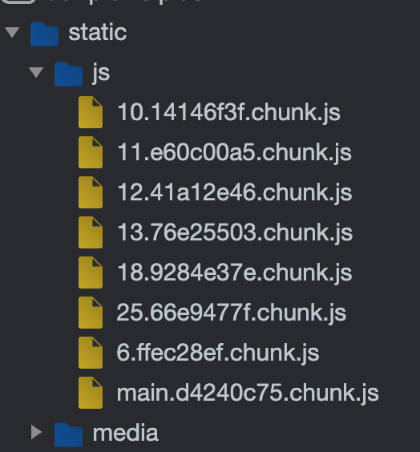

# ChunkLoadError 해결하기(Webpack 설정 X)

- CRA를 사용하여 React Project를 생성하면, Webpack 설정이 기본적으로  
  제공된다. 이 설정을 굳이 건들지 않고 ChunkLoadError를 해결해보자.

<h2>ChunkLoadError가 발생하는 이유</h2>

- 별도 설정 없이 React Project를 build하면 `build/static/js`의 하위에  
  아래와 같은 파일들이 생겨난다.



- 이렇게 빌드하게 되면 `[number].[hash].chunk.js` 형식의 파일이 나오게 된다.

- 우리가 `a.com`을 만든다고 해보자. 사용자는 `a.com`에 들어오는 순간 위의 chunk 파일들을 받아온다.  
  이때, 사용자가 페이지를 새로고침하는 등의 행동을 취하지 않으면 chunk파일은 브라우저에 남아있게 된다.

- 사용자가 `a.com`에 있는 동안에 새로운 배포가 이루어졌다고 해보자. 그러면 새로운 배포에 당연히 빌드도 다시 하기에  
  chunk 파일들도 새롭게 생겨날 것이다. 이때, 기본적으로 새로운 chunk 파일을 자동으로 불러오지 않기에  
  `ChunkLoadError`가 발생한다. 내용은 아래와 같다.

```
ChunkLoadError: Loading chunk [number] failed.
(missing: https://a.com/static/js/[number].[hash].chunk.js)
```

- 에러 내용을 봐도 chunk 파일을 찾지 못한다는 것을 알 수 있다.  
  Chunk파일을 찾지 못하면 당연히 JavaScript가 동작하지 않기에 심할 경우에는  
  웹 페이지가 Blank가 되는 경우도 발생한다. 이는 사용자 경혐에 매우 큰 악영향을 미칠 수 있으므로  
  꼭 해결해주어야 한다.

<hr/>

<h2>해결하기: react-error-boundary</h2>

- 이 방법은 ChunkLoadError가 발생했을 때 무조건 페이지를 새로고침하도록 한다.  
  만약 State등을 굳이 유지해야하는 상황이라면 이 방법을 사용하면 안된다.

- 우선 에러가 발생할 수 있는 컴포넌트들을 묶어 에러를 처리할 수 있게 해주는 컴포넌트를  
  npm의 `react-error-boundary` 패키지로 받아오자.  
  ChunkLoadError는 모든 Route에서 발생할 수 있으므로 `App.tsx`에서 모든 컴포넌트를 묶어주자.

```tsx
// App.tsx

// Other codes..

return (
  <ErrorBoundary FallbackComponent={ErrorFallback}>
    <ComponentOne />
    <ComponentTwo />
    <ComponentThree />
  </ErrorBoundary>
);
```

- `ErrorBoundary` 컴포넌트는 prop으로 FallbackComponent를 전달할 수 있는데, 이 속성에는 에러를 처리할  
  컴포넌트를 넘겨주면 된다.

- 위에서 FallbackComponent로 넘겨준 `ErrorFallback` 컴포넌트를 보자.

```ts
// ErrorFallback.tsx

// 아래는 다른 곳에서 직접 만든 에러 시에 띄워줄 ErrorComponent
import { ErrorComponent } from "components";

const CHUNK_LOAD_ERROR = "ChunkLoadError";
const KEY = "chunk_failed";

interface Item {
  value: string;
  expiry: number;
}

const ErrorFallback = ({ error }: { error: Error }): JSX.Element => {
  useEffect(() => {
    if (error?.name && error.name === CHUNK_LOAD_ERROR) {
      if (!getWithExpiry(KEY)) {
        setWithExpiry(KEY, "true", 10000);
        window.location.reload();
      }
    }
  }, [error]);

  return <ErrorComponent error={error} />;
};

const setWithExpiry = (key: string, value: string, ttl: number) => {
  const item: Item = {
    value: value,
    expiry: new Date().getTime() + ttl,
  };
  localStorage.setItem(key, JSON.stringify(item));
};

const getWithExpiry = (key: string): string | null => {
  const itemString = localStorage.getItem(key);
  if (!itemString) return null;
  const item = JSON.parse(itemString);
  const isExpired = new Date().getTime() > item.expiry;

  if (!isExpired) {
    localStorage.removeItem(key);
    return null;
  }
  return item.value;
};

export default ErrorFallback;
```

- 이제 `App.tsx`에서 `ErrorBoundary`로 묶여진 하위의 컴포넌트들에서 에러가 발생하면  
  위의 `ErrorFallback`으로 들어올 것이다. 그리고 만약 그 에러가 ChunkLoadError라면  
  페이지를 `window.location.reload()`로 새로고침해 줄 것이다.

- `getWithExpiry()`와 `setWithExpiry()` 함수를 만들어서 활용한 이유는 새로고침의 무한루프에 빠지는 것을  
 방지하기 위함이다. localStorage에 저장하는 것은 10000ms(10초)라는 value를 가진 item인데,  
 이 item이 있다면 10초가 지났는지를 확인하고 새로고침의 여부를 결정하기에 무한루프를 방지할 수 있다.
<hr/>

<a href="https://mitchgavan.com/code-splitting-react-safely/">참고 링크</a>
