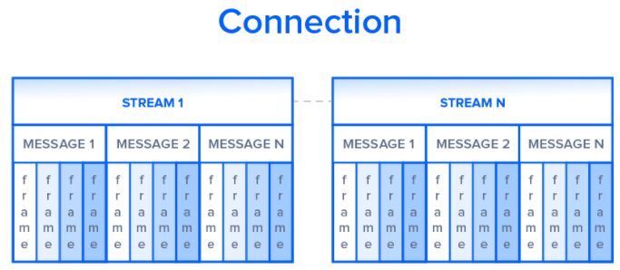
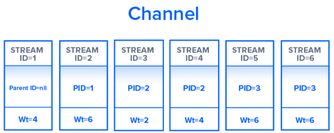
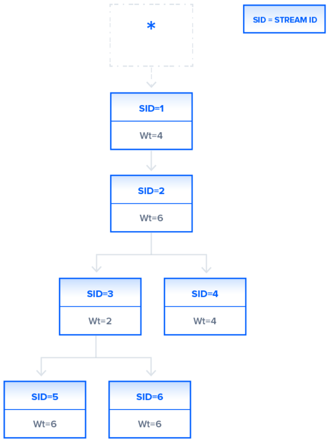

# HTTP 1.1과 HTTP 2.0의 차이

# 들어가며

- HTTP(HyperText Transfer Protocol)은 WWW(World Wide Web)상에서의 소통을 위한 표준화된 방식으로  
  1997년에 사용되기 시작한 통신 수단이다. 1997년부터 현재까지 이 프로토콜에는 여라 가지의 수정사항이 있었다.  
  하지만 2015년에 들어서면서 통신 지연에 대한 여러 가지 해결점(특히 모바일 플랫폼, 그래픽, 영상)들을 제공하는  
  HTTP 2.0이 사용되기 시작했다. 이후로 HTTP 2.0의 사용률은 급격하게 증가했다.

<hr/>

# HTTP 1.1

- Timoty Berners-Lee라는 사람에 의해 개발되어 WWW의 표준화된 통신 수단으로 사용된 HTTP는  
  클라이언트와 로컬 또는 원격의 서버와 통신하는 Top-Level Application Protocol이다.  
  이 통신 과정에서, 클라이언트는 텍스트 기반의 요청을 `GET`, `POST` 등의 HTTP Method를 통해  
  전송하게 된다. 이에 대한 응답으로, 서버는 JSON 또는 HTML 페이지와 같은 리소스를 읃답해준다.

- 예를 들어, 우리(클라이언트)가 `www.example.com`이라는 웹사이트를 방문한다고 해보자.  
  이 URL로 접속하게 되면, 우리가 사용하는 웹 브라우저는 텍스트 기반의 HTTP Request를 보내게 된다.  
  아래는 HTTP Request의 예시이다.

```
GET /index.html HTTP/1.1
Host: www.example.com
```

- 위 예시에서의 요청은 `GET` 메소드를 사용하며, Host로 지정되어 있는 www.example.com에 요청을 보내게 된다.  
  이에 대한 응답으로, example.com의 웹서버는 HTML페이지를 요청한 클라이언트에게 전달해준다.  
  이 과정에서, 단순히 HTML 파일만 보내주는 것이 아니라 이 페이지에서 사용하는 이미지, CSS 파일, 다른 스크립트 파일들이  
  모두 포함되어 있다. 한 가지 주의할 점은, **첫 요청에 모든 리소스가 클라이언트에게 전달되는 것이 아니다** 는 것이다.  
  요청과 응답의 과정은 서버와 클라이언트 사이에서 HTML페이지를 모두 렌더링할 수 있게 될 때 까지 여러 번 진행된다.

<hr/>

# HTTP 2.0

- HTTP 2.0은 Google에서 웹 페이지 로딩 지연을 해결하기 위해 내세운 기술들(압축, Multiplexing, Prioritization)을  
  적용한 SDPY 프로토콜로 시작되었다.

- 기술적인 관점에서 본다면 HTTP/1.1과 HTTP/2를 구분짓는 핵심적인 요소들 중 하나는 binary framing layer이다.  
  Binary framing layer는 인터넷 프로토콜 스택 중 가장 최상위에 있는 Application Layer의 일부라고 보면 된다.

- HTTP/1.1이 모든 요청과 응답에 대한 정보를 일반적인 텍스트(plain text)로 모두 저장하고 있다는 점과 다르게,  
  HTTP/2.0은 Binary framing layer를 사용하여 모든 메시지를 2진수 형태(Binary Format)로 저장한다는 것이다.  
  하지만 이렇게 2진수로 저장함과 동시에 HTTP verb, Method, Header등과 같은 기본적인 정보를 유지하도록 되어있다.

- Application Level의 API는 계속 관례적인 HTTP 형식으로 메시지를 생성하지만, 안쪽 layer에서는 이 메시지들을  
  2진수로 변환하여 저장하는 것이다. 이 절차는 HTTP/2.0 이전에 만들어진 웹 애플리케이션들이 HTTP/2.0을 사용하여  
  소통하는데 문제가 없다는 것을 보장해준다.

- 이렇게 메시지들을 2진수로 변환하는 과정은 HTTP/1.1에서는 수행될 수 없던 데이터들의 전달의 한계점을 극복해준다.

<hr/>

# Delivery Models

- 위에서 말한대로, HTTP 1.1과 HTTP 2.0은 기본적인 형식을 공유하여 서버와 클라이언트 사이에 오고가는  
  요청과 응답이 전통적으로 포맷팅 되어 있는 메시지와 헤더, Body와 함께 목적지에 도달하도록 해준다.  
  하지만 HTTP 1.1은 이 과정을 Plain Text로 구성된 메시지로 진행하는 반면, HTTP 2.0은 2진수로 진행한다.

- 이제 HTTP 1.1이 Delivery Model을 이용해서 메시지를 어떻게 효과적으로 최적화하려고 시도했는지와  
  이로 인해 생겨난 문제점을 알아보자. 그리고 HTTP 2.0의 Binary framing layer의 이점과  
  요청들의 우선순위를 어떻게 책정하는지에 대해 알아보자.

<h2>HTTP/1.1 - Pipelining and Head-Of-Line Blocking</h2>

- 클라이언트가 HTML 페이지에 대해 처음으로 `GET` 요청을 보냈을 때, 대부분의 경우에 응답으로 오는 페이지로는  
  전체적인 렌더링을 할 수 없다. 대신, 첫 번째 요청에 대한 응답은 요청한 페이지에서 추가적으로 사용할 리소스들에 대한  
  정보(링크 등)들을 포함한다. 클라이언트는 첫 번째 `GET` 요청에 대한 응답이 오고 나서야 이 페이지를 렌더링하기 위해  
  추가적인 리소스들을 더 받아와야 한다는 사실을 알게 된다. 따라서 자연스럽게 클라이언트는 서버에게 추가적인 요청을 보내게 된다.  
  HTTP/1.0에서는 클라이언트가 새로운 요청을 보낼 때마다 TCP 연걸을 다시 만들어야 했다.

- HTTP/1.1은 HTTP/1.0이 매 요청마다 새로운 TCP 연결을 수립해야 한다는 매우 많은 비용이 소모되는 작업을  
  `Persist Connection`와 `Pipelining`으로 해결한다.  
  `Persist Connection(계속되는 연결)`을 사용해서, HTTP/1.1은 해당 TCP연결을 닫으라는 메시지가 있기 전까지  
  Connection을 끊지 않는다. 이는 클라이언트가 같은 Connection 내에서 요청에 대한 응답을 기다리지 않고 비동기적으로  
  여러 개의 요청을 동시다발적으로 보낼 수 있게 해준다. 이렇게 하나의 요청을 보내고, 그에 대한 응답을 기다리고, 그 뒤에  
  새로운 요청을 보내는 작업이 HTTP/1.1이 HTTP/1.0에 비해 성능이 매우 향상될 수 있던 요인 중 하나이다.

- 하지만 `Persist Connection`을 사용한 효율화는 원천적인 단점이 있다.  
  여러 개의 Data Packet이 서로를 앞질러서 목적지(Destination)에 도달할 수 없기에, (Queue라고 보면 된다.)  
  만약 가장 먼저 수행된 요청(큐의 맨 앞)이 모종의 이유로 응답을 받아올 수 없다면, 뒤에 수행된 요청들에 대한 응답들도  
  모두 받아오지 못한다.

- 위의 문제점을 `HOL(Head-Of-Line) Blocking` 현상이라 하며, 이는 Connection을 효율화한 HTTP/1.1의  
  매우 큰 문제점이다. 이 `HOL Blocking` 현상을 방지하기 위해 HTTP/1.1은 병렬적인 TCP Connection의 수립으로 이 문제를  
  해결하려 했다. 하지만 애초에 클라이언트와 서버 사이에서 동시적으로 수립될 수 있는 TCP Connection의 개수에 제한이 있기에 완전한  
  해결책은 아니다.

<hr/>

<h2>HTTP/2.0 - Binary Framing Layer의 이점</h2>

- HTTP/2.0 에서, Binary framing layer는 요청과 응답을 2진수로 인코딩하며, 이들을 더 작은 정보의 단위로  
  쪼개게 되어 데이터 송수신 작업에 유연함을 크게 더해준다.

* 우선 HTTP/1.1이 HOL Blocking 현상을 방지하기 위해 여러 개의 TCP Connection들을 수립해야 했던 것과 반대로,  
  HTTP/2.0은 **단 1개의 TCP 연결** 만을 수립한다. 이 연걸 안에는 **data로 구성된 여러개의 Stream** 이 있다.  
  각 Stream은 익숙한 요청/응답의 형식으로 된 메시지들을 담고 있다.  
  마지막으로, 각 하나의 Stream안의 여러 메시지들을 각각 **Frames** 라 하는 더 작은 단위로 쪼개어진다.



- Communication Channel은 여러 개의 2진법으로 인코딩되어 있는 Frame들을 가지며, 이 Frame들은 각각  
  특정 Stream에 소속되어 있다. 각 Frame들은 고유 식별자로 `Identifying Tag`를 가지는데, 이 태그를 통해  
  Connection이 다른 작업들을 수행하고 난 후에 다시 이 작업을 수행할 수 있도록 해준다.  
  즉, 요청과 응답의 과정이 하나의 Connection 내에서 병렬적으로 수행되며, 비동기적으로 수행될 수 있다는 것이다.  
  이 과정을 `Multiplexing`이라 한다. Multiplexing은 HTTP/1.1의 HOL Blocking 현상을 해결해준다.  
  이는 또한 서버와 클라이언트가 동시다발적으로 다수의 요청과 응답을 주고받을 수 있다는 것을 의미하며, 곧  
  훨씬 조절 가능하고 효율적인 Connection 관리가 가능해짐을 의미한다.

- Multiplexing이 클라이언트가 병렬적으로 여러 개의 Stream들을 만들 수 있도록 해주기 때문에, 이 Stream들은  
  **단 1개의 TCP Connection** 만을 사용해도 된다. Origin별로 `Persist Connection`을 가능하게끔 해준  
  HTTP/1.1 덕분에, 이는 훨씬 효율적인 네트워크의 사용과 모든 연산 비용을 최적화해준다.

- 단 하나의 TCP Connection만을 사용해도 된다는 것은 HTTPS Protocol의 성능도 향상시켜준다.  
  왜냐하면 클라이언트와 서버가 안전하게 관리되는 세션 하나로 여러 개의 요청과 응답을 주고받을 수 있기 때문이다.  
  HTTPS내에서 TLS 또는 SSL Handshake 과정에서, 클라이언트와 서버는 단 하나의 key를 해당 세션 내에서  
  사용하도록 한다. 만약 해당 세션이 종료되고, 새로운 세션이 시작되녀면 그에 맞게 key도 새롭게 발급해야 한다.  
  따라서 하나의 Connection을 유지하는 것은 HTTPS를 사용하는데에 매우 효율적일 수 밖에 없다.

- 한 가지 유의할 점은, 많은 브라우저들이 HTTP/2.0을 HTTPS 프로토콜로만 지원한다는 점이다.

- Multiplexing이 HTTP/1.1의 문제점들을 해결해주긴 하지만, 같은 리소스에 대한 응답을 기다리는  
  여러 개의 Stream들이 있다면, 이는 여전히 성능적인 이슈를 야기할 것이다. 이를 HTTP/2.0은  
  Stream Prioritization으로 해결한다.

<hr/>

<h2>HTTP/2.0 - Stream Prioritization</h2>

- `Stream Prioritization`은 동일한 리소스에 대한 요청들이 겹치는 현상도 방지하는 동시에, 개발자에게  
  각 요청마다 상대적인 가중치를 부여할 수 있게 하여 애플리케이션 성능을 최적화할 수 있도록 해준다.

- 이제 알 수 있듯이, Binary Framing Layer는 메시지들을 병렬적인 데이터들의 stream으로 정리한다.  
  클라이언트가 동시다발적으로 서버에게 요청을 보내면, Binary Framing Layer는 1에서 256사이의 가중치를  
  각 stream에 부여하여 어떤 응답을 먼저 처리할지에 대한 정의를 할 수 있다.  
  높은 가중치(256에 가까울 수록)는 더 우선순위가 높음을 의미한다.  
  이에 추가적으로, 만약 특정 stream이 다른 stream에 의존성(Dependency)을 가진다면, 클라이언트는  
  어떤 stream들이 의존 관계를 가지는지를 stream의 ID를 통해 표현한다.  
  만약 parent identifier(부모 식별값, 부모의 stream ID)가 누락되었다면, 해당 stream은  
  Root Stream(최상위 stream)에 의존성을 갖는다고 취급된다. 아래 그림을 보자.



- 위 그림에서, Channel은 각각 고유한 ID값과 Wt(weight, 가중치)가 부여된 6개의 Stream들로 구성된다.  
  `Stream ID 1`은 Parent ID가 nll(null)로 기입되어 있다. 이는 곳 Root stream에 의존성을 갖음을 의미한다.  
  1번 Stream을 제외한 나머지 Stream들은 모두 PID(Parent ID)가 명시되어 있다.  
  각 stream에 대한 리소스 할당량은 부여된 가중치와 요구하는 의존성 관계에 따라 결정된다.  
  예를 들어, `Stream ID 5`와 `Stream ID 6`의 관계에서, 이 둘은 같은 PID를 가지며 Wt(Weight)값 또한 동일하다.  
  이는 곧 이 두 Stream들은 리소스 할당에 있어 동일한 우선순위를 가짐을 의미한다.

* 위 그림에서 보았듯이, Stream들의 `PID(Parent ID)`와 `Wt(Weight)`를 이용하여 서버는  
  의존성 트리(Dependency Tree)를 생성하여, 어떤 요청이 우선적으로 수행되어야 하는지를 결정한다.  
  위 그림에 있던 Stream의 경우, 아래의 의존성 트리가 생긴다.



- 위 Dependency Tree를 살펴보자.  
  우선 `Stream ID 1`은 PID가 null이기에 Root에 대해 의존성을 갖는다.  
  **Root에 의존성을 갖는 다는 것은 가장 먼저 수행되어야 함을 의미** 한다.  
  다음으로, `Stream ID 2`는 PID가 1이기에, `Stream ID 1`에 의존성을 가진다.  
  이는 곧 `Stream ID 2`의 작업은 `Stream ID 1`의 작업이 완료될 때 까지 수행되지 않을 것임을 의미한다.  
  이제 `Stream ID 3`과 `Stream ID 4`를 살펴보자. 이 둘은 모두 PID가 2로, `Stream ID 2`에 의존성을  
  가진다. 하지만 이 둘의 Wt값은 각각 2와 4로, `Stream ID 4`가 `Stream ID 3`보다 가중치 값이 더 크다.  
  따라서 `Stream ID 2`의 작업이 모두 끝나면, `Stream ID 3`과 `Stream ID 4`가 수행된다.  
  마지막으로, `Stream ID 3`의 작업이 모두 끝나면, PID가 3인 `Stream ID 5`와 `Stream ID 6`의  
  작업이 수행된다.  
  위 과정에서, `Stream ID 4`가 `Stream ID 3`보다 가중치가 더 크니, `Stream ID 4`가 수행되고,  
  `Stream ID 3`이 수행된 다음, `Stream ID 5`와 `Stream ID 6`이 수행되어야 하는게 아닌가 라는 생각이 들 수 있다.  
  `Stream ID 3`과 `Stream ID 4`는 서로 같은 부모(`Stream ID 2`)에 종속되어 있지만, 둘 간의 직접적인  
  의존 관계는 없기 때문에 서로의 작업 순서는 상관이 없다. 즉, Wt값이 다르기에 서버는 리소스의 우선순위에 따라 당연히  
  Wt값이 더 큰 `Stream ID 4`부터 작업을 하지만, `Stream ID 3`의 작업이 `Stream ID 4`의 작업이 끝날 때 까지  
  기다리지 않게 된다. 때에 따라서, `Stream ID 3`의 작업이 `Stream ID 4`보다 늦게 시작되었음에도 불구하고  
  빨리 끝났다면, `Stream ID 4`의 작업이 끝나지 않았음에도 `Stream ID 5`와 `Stream ID 6`의 작업이  
  시작될 수도 있다. 즉, **더 하위에 있는 Stream들은 직접적으로 연관된 부모 Stream의 작업이 끝나기만 한다면 시작**  
  한다는 것이다.

- 애플리케이션 개발자는 요구사항에 따라 요청에 대해 가중치를 부여할 수 있다. 예를 들어, 고해상도 이미지 파일을  
  원하는 요청을 썸네일을 보여주는 요청을 먼저 수행하도록 한 다음에 수행하도록 할 수 있다.  
  이렇게 Weight를 사용하여 HTTP/2.0은 개발자에게 웹 페이지 렌더링에 대해 더 많은 control을 부여한다.  
  또한 HTTP/2.0은 사용자 반응에 따라 클라이언트가 Runtime 내에서 의존성 관계와 가중치 값을 변경할 수도 있게 해준다.  
  주의할 점으로는 만약 특정 리소스에 접근하고 싶은 stream이 모종의 이유로 block되었다면, 서버가 인위적으로  
  우선순위를 변경할 수도 있다는 점이다.

<hr/>
