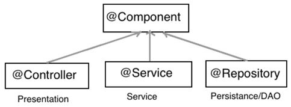

<h1>@Component, @Service, @Controller ,@Respository의 차이</h1>

<h2>들어가며</h2>

* `@Component`, `@Service`, `@Controller` `@Repository`의 차이를 알아보기 전에   
  우선적으로 Spring에서 `@Component`의 역할을 파악하는 것이 우선이다.

* Spring의 초기 배포 당시에는 모든 Bean 객체들을 XML 파일에 직접 등록해줘야 했다.   
  프로젝트의 규모가 점점 커지면 이 과정은 상당히 신경을 써야하는 부분이 되며,   
  이를 해결하기 위해 Spring에서 내놓은 것이 어노테이션 기반 방식으로 이를 해결하는 것이다.

* Spring 2.5 버전부터 어노테이션으로 DI(Dependency Injection)를 수행할 수 있게 되었다.   
  여기서 `@Component`가 등장했으며, `@Component`가 선언된 클래스는 Spring Bean으로   
  자동적으로 등록된다.

* 이는 곧 개발자가 기존 방식처럼 Bean 객체를 `<bean>` 태그에 직접 명시하여 의존성을   
  추가하지 않아도 됨을 의미한다.
<hr/>

<h2>그래서 차이점은?</h2>

* `@Component`와 위에 작성한 그 외의 어노테이션들은 __차이가 없다.__   
  예를 들어 Spring MVC에서 컨트롤러 클래스임을 알리기 위해 `@Controller`를 작성하는데,   
  이는 `@Component`와 비교했을 때 네이밍이 더 파악하기 쉽다는 것 밖에 다를 점이 없다.

* 예를 들어 `DispatcherServlet`은 클래스들 중 `@Controller`가 적용된 클래스들 내에서   
  `@RequestMapping`이 적용된 메소드를 찾아 요청을 매핑할 것이다.   
  이는 곧 `@Controller`와 `@Component`는 Bean 객체의 생성과 DI의 관점에서 보면 다른 점이 없다.   
  (물론 결과적으로는 `@Controller` 타입으로 Bean객체를 등록하긴 한다.)   
  심지어는 `@Controller`를 `@Component`로 바꿔써도 Spring은 자동적으로 컨트롤러 클래스를   
  Bean 객체로 등록한다. (하지만 원하는대로 작동하지 않을 수도 있다.)

* `@Service`와 `@Repository`도 마찬가지 이다. 차이점이라고 한다면   
  `@Service`는 Service Layer를 위해 특수화 되어 있고, `@Repository`는 Persistence Layer를   
  위해 특수화되어 있다는 것이다.

* Service Layer에 있는 Spring Bean은 `@Component`  대신 `@Service` 어노테이션이 적용되어야 하며,   
  Persistence Layer에 있는 Beean은 `@Repository`가 적용되어야 한다.

* 이렇게 계층에 알맞은 어노테이션을 사용함으로써 우리는 해당 어노테이션이 적용된 클래스가   
  Spring Bean으로 취급됨을 보장함과 동시에 해당 계층에 알맞은 기능을 수행하도록 할 수 있다.
<hr/>

<h2>Spring에서 컴포넌트 스캔이 동작하는 방식</h2>

* Spring 2.0 부터 Spring은 `<context:component-scan>` 또는 어노테이션 기반의 의존성 주입 방식을   
  지원한다. 이 방식은 Spring이 자동으로 Spring Bean으로 등록될 대상들을 인식하고 등록해준다.

* 하지만 이 방식은 `@Controller`, `@Service`, `@Repository`는 검색하려 하지 않고   
  오로지 `@Component` 어노테이션이 붙은 객체들만 인식하려 한다.

* 그렇다면 `@Controller`, `@Service`, `@Repository`로 된 객체들이 Bean으로 등록되는 이유는 뭘까?   
  이유는 생각보다 간단한데, 어노테이션 자체가 `@Component` 어노테이션이 적용되어 있기 때문이다.
```java
@Target({ElementType.TYPE})
@Retention(RetentionPolicy.RUNTIME)
@Documented
@Component
public @interface Repository {
	@AliasFor(annotation = Component.class)
	String value() default "";
}

@Target({ElementType.TYPE})
@Retention(RetentionPolicy.RUNTIME)
@Documented
@Component
public @interface Service {
	@AliasFor(annotation = Component.class)
	String value() default "";
}

@Target({ElementType.TYPE})
@Retention(RetentionPolicy.RUNTIME)
@Documented
@Component
public @interface Controller {
	@AliasFor(annotation = Component.class)
	String value() default "";
}
```

* 따라서 `@Controller`, `@Service`, `@Repository`가 `@Component`의 특수한 타입이라고   
  말하는 것은 전혀 틀린 말이 아님을 알 수 있다.   
  `<context:component-scan>` 어노테이션은 위 어노테이션들을 스캔한 뒤에   
  각 클래스들을 `@Component`가 적용된 것처럼 Spring Bean 객체로 등록시킨다.
<hr/>

<h2>정리</h2>

* 간단히 정리하면 아래와 같다.
  * `@Component` : Spring이 관리하는 컴포넌트 또는 Bean을 가리키는 Generic Stereotype이다.
  * `@Repository` : Persistence Layer를 위한 stereotype이다.
  * `@Service` : Service Layer를 위한 stereotype이다.
  * `@Controller` : Presentation Layer를 위한 stereotype이다.



<hr/>

<a href="https://javarevisited.blogspot.com/2017/11/difference-between-component-service.html#ixzz6jcfPTt5s">참고 링크</a>