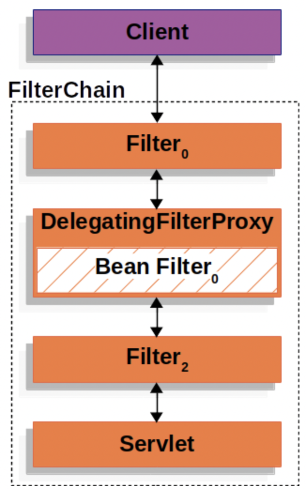

<h1>Filters with Spring</h1>

<h2>DelegatingFilterProxy</h2>

- Spring은 `Filter`의 구현체 중 하나인 `DelegatingFilterProxy`라는 객체를 제공한다.  
  이 객체는 Servlet Container의 생명 주기와 Spring의 `ApplicationContext`를 이어주는 역할을 한다.

- Servlet Container에는 `Filter`들을 등록할 수 있지만, Spring Bean들에 대해서는 자체적으로 알지 못한다.  
  이를 해결하는 것이 `DelegatingFilterProxy`객체이다. 이 객체를 사용하면 Spring Bean들을 사용하는  
  `Filter`들을 Servlet Container에 등록할 수 있다.

- 아래 그림은 `DelegatingFilterProxy`가 `Filter`들과 `FilterChain`에서 하는 역할을 그린 것이다.



- `DelegatingFilterProxy`는 `ApplicationContext`에 있는 Bean Filter를 찾아보고, 해당 Bean Filter의  
  작업을 호출한다. 아래는 `DelegatingFilterProxy`의 Pseudo code이다.

```java
public void doFilter(ServletRequest request, ServletResponse response, FilterChain chain) {
    // Spring Bean으로 등록된 Filter들을 Lazy 방식으로 찾는다.
    Filter delegate = getFilterBean(beanName);

    delegate.doFilter(request, response);
}
```

- `DelegatingFilterProxy`의 또다른 장점은 bean으로 등록된 `Filter`들을 찾는 작업을 Lazy하게 해준다는 것이다.  
  Spring은 `ContextLoaderListener`를 사용하여 Spring Bean들을 불러오는데,  
  이 과정은 `Filter` 인스턴스들이 등록되어야 할 때 까지 수행되지 않는다.  
  이것이 중요한 이유는 컨테이너가 시작되기 전에 컨테이너에 `Filter` 인스턴스들을 먼저 등록해야 하기 때문이다.  
  즉 무조건 `Filter`들이 컨테이너에 등록되는 것을 막고, Spring Bean으로 등록된 `Filter`들을 필요할 때에  
  `ContextLoaderListener`가 불러오게끔 한다는 것이다. 만약 이 과정이 생략된다면 Spring Bean으로 등록된 `Filter`들은  
  Servlet Container에 등록되지 못할 것이다.(위에서 말했듯이 Servlet Container는 Spring Bean들에 대해 모르기 때문)

<hr/>
