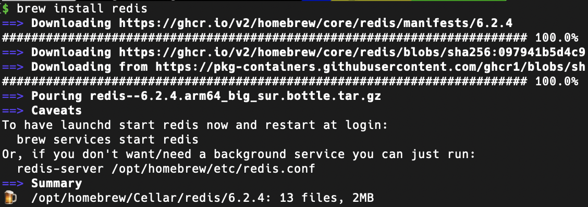
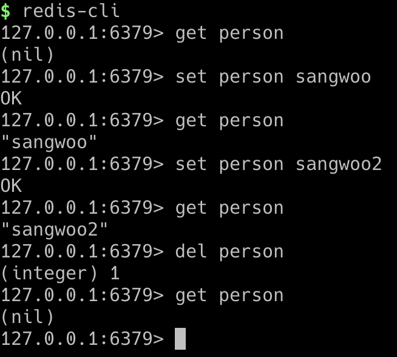

# Redis 설치하기

- Redis를 사용하기 위해서는 당연히 Redis를 먼저 설치해야 한다.  
  AWS의 ElastiCache 등을 사용하기 전에 우선 Local에 먼저 설치해보자.

- Redis Server를 시작하는 가장 간단한 방법은 추가적인 argument 없이 단순히 `redis-server` 명령어를  
  수행하는 것이다.

- Redis Server가 잘 작동하는지를 확인하는 방법은 아래 명령어를 수행하면 응답이 PONG으로 오는지 확인하면 된다.

- Redis는 Key-Value로 데이터를 저장하며, 데이터 저장시에는 `set [KEY] [VALUE]` 형식으로 저장하며,  
  원하는 key에 해당하는 value를 가져오고 싶을 때에는 `get [KEY]`를 수행하면 된다.  
  만약 해당하는 key에 대한 value가 없다면 nil이 반환된다.

- 위 사진에서는 처음에 `person`이라는 key로 value를 읽으려 했지만, 존재하지 않기에 `(nil)`이 반환되었다.  
 그 후에는 `set person sangwoo`를 수행하여 key가 person이고, value가 sangwoo인 객체를 저장했다.  
 그 후 `get person`을 하니 key가 person인 객체의 value인 `"sangwoo"`가 반환되었다.  
 그 다음으로는 `set person sangwoo2`를 하여, key가 person인 객체의 value를 sangwoo2로 update했다.  
 그러니 `get person`을 하면 `"sangwoo2"`가 반환된 것이다.  
 마지막으로 `del person`을 수행하여 key가 person인 객체를 삭제했다.

