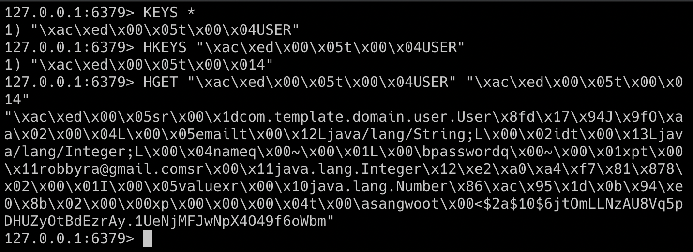

# Redis 적용하기(직접 구현)

<h2>기존 상황</h2>

- 간단한 상황을 살펴보자. 사용자(User)의 정보를 Redis에 저장하고 싶다.  
  사용자는 userId, email, name의 필드들을 가지며 아래는 기존의 서비스 코드이다.

```kt
@Service
class UserService(private val findUser: FindUser) {

    @Transactional(readOnly = true)
    fun getUserInfo(): UserInfoResponseDto {
        val user = findUser.get()
        return UserInfoResponseDto(user)
    }
}
```

- 위 코드가 포함된 전체 코드는 readme에 있는 링크에서 볼 수 있다.

- 위 코드 대로라면, 사용자가 사용자 정보를 조회하는 API를 호출할 때 마다 데이터베이스에서  
 해당 사용자의 정보를 READ해와야 한다.  
 이제 Cache를 적용해서 Redis에 이미 정보가 있다면 Redis에서 읽어오고, 없다면 데이터베이스에서 가져오도록 해보자.  
 Cache를 지원하는 라이브러리를 사용하기 전에, 직접 한 번 구현해보도록 하자.
<hr/>

<h2>Redis 적용해보기</h2>

- 최대한 간단하게 Redis를 도입해보자.  
  사용자가 정보를 조회하는 API를 호출했을 때의 시나리오는 아래와 같다.
  - (1) 클라이언트의 사용자 정보 조회 요청
  - (2) Redis에 정보가 있는지 검사
  - (3-1) Redis에 정보가 있다면 그대로 반환
  - (3-2) Redis에 정보가 없다면 RDB에서 정보를 읽어온 후, 추후 요청을 위해 Redis에 저장

<h3>필요한 Spring Bean 등록하기</h3>

- Spring Boot의 Main Application에 redis를 사용하기 위한 필수적인 Spring Bean을 등록하자.

```kt
class Application {

  // 다른 설정 및 Spring Beans..

  @Bean
    fun userRedisTemplate(redisConnectionFactory: RedisConnectionFactory): RedisTemplate<String, User> {
        val redisTemplate = RedisTemplate<String, User>()
        redisTemplate.connectionFactory = redisConnectionFactory
        return redisTemplate
    }
}
```

- 우선 위 코드는 `RedisTemplate`을 Spring Bean으로 등록하는데, 제네릭 타입에 넣어준 타입들을 보면  
  `String`과 `User`가 있다. `String`은 내장 타입이며 `User`는 RDB의 users 테이블을 나타낸 Entity 객체이다.  
  위 `userRedisTemplate`은 Key의 타입이 String이고, Value에는 `User`의 타입을 지정해주었다.  
  `RedisTemplate`은 직렬화, 역직렬화를 간단히 진행할 수 있도록 해주는 Helper Class이다.

- Spring Boot의 자동 설정 덕분에 `RedisConnectionFactory`에 대한 추가적인 설정은 해줄 필요가 없다.

- 위 코드에서 직렬화를 하기에 이제 `User`는 `java.io.Serializable` 인터페이스를 구현하도록 해야 한다.

<h3>RedisRepository 작성하기</h3>

- Redis와의 데이터 처리를 담당하는 Repository 코드를 작성해보자.  
  클래스명은 `UserRedisRepository`로 했다.

```kt
@Repository
class UserRedisRepository(
    userRedisTemplate: RedisTemplate<String, User>
) {

    private var hashOperations: HashOperations<String, String, User>? = null

    init {
        hashOperations = userRedisTemplate.opsForHash()
    }

    fun save(user: User) {
        hashOperations?.put("USER", user.id!!.toString(), user)
    }

    fun findById(userId: Int): User? {
        return hashOperations?.get("USER", userId.toString())
    }
}
```

- userRedisTemplate 변수는 위에서 작성한 Spring Bean을 자동으로 의존성 주입을 받았고,  
  hashOperations 객체는 직접 생성자에서 초기화 시 만들어주었다.

- `HashOperations` 객체는 Redis에 대해 Hash 작업을 수행하도록 해주는 클래스인데,  
  사용자 정보를 저장하기 위해 Hash를 사용한 이유는 아래와 같다.

  - 사용자 정보의 Value는 단순한 값이 아니라 객체이다.
  - 사용자는 UserId라는 고유한 값으로 구분되는데, 이때 Key값을 정하기가 까다롭다.  
    (그냥 Key에 userId값만 준다면 혼동을 일으킬 수 있다.)

- `HashOperation`의 3가지 제네릭 타입은 순서대로 Hash Key의 타입, Key의 타입, Value의 타입이다.

- `save()`는 HashKey가 USER이고, Key가 userId이며 Value가 `User`인 객체를 저장하며,  
  `findById()`는 HashKey가 USER이고, Key가 인자로 받은 userId인 객체를 찾아 있으면 해당 객체를  
  반환하고, 없다면 null을 반환한다.

- 이제 실제 사용자를 불러오는 로직에 `UserRedisRepository`를 사용하여 로직을 적용해보자.

<h3>비즈니스 로직에 적용하기</h3>

- 아래에 있는 `FindUser`는 Spring Security의 인증 과정 중, JWT를 Decoding한 후 userId를 꺼내와서  
  해당 user에 대한 정보를 RDB에서 읽어와서 반환하는 코드였다.

```kt
@Component
class FindUser : Supplier<User> {

    @Autowired
    private lateinit var userRepository: UserRepository

    override fun get(): User {
        val userId = Integer.parseInt((SecurityContextHolder.getContext().authentication.principal as UserDetailsImpl).username)
        return userRepository.findById(userId).orElseThrow { UserUnAuthorizedException() }

    }
}
```

- 이제 위 코드에 Redis를 가장 처음에 정한 로직대로 적용해보자.

```kt
@Component
class FindUser : Supplier<User> {

    @Autowired
    private lateinit var userRepository: UserRepository

    @Autowired
    private lateinit var userRedisRepository: UserRedisRepository

    override fun get(): User {
        val userId = Integer.parseInt((SecurityContextHolder.getContext().authentication.principal as UserDetailsImpl).username)
        val cachedUser = userRedisRepository.findById(userId)
        return if(cachedUser == null) {
            val user = userRepository.findById(userId).orElseThrow { UserUnAuthorizedException() }
            userRedisRepository.save(user)
            user
        } else cachedUser
    }
}
```

> `UserRedisRepository`는 `@Repository` 어노테이션으로 Component로 등록되었기에 자동 주입 받을 수 있다.

<hr/>

<h2>결과 확인하기</h2>

- 비록 우리가 `HashOperations`를 사용할 때 Hash Key에 "USER"라고 지정을 해줬지만, Redis는 이를 다시 Hashing하여  
  Redis에 INSERT 한다. 따라서 `HGET USER`로는 아무런 값도 찾을 수 없다.

- 우선, 어떤 값으로 저장되었는지를 확인하기 위해 `KEYS *` 명령을 수행해보자.  
  대략 아래와 같은 모양의 Key가 나올 것이다.

```
127.0.0.1:6379> KEYS *
1) "\xac\xed\x00\x05t\x00\x04USER"
```

- 나는 userId가 4인 객체에 대해 테스트를 해보았는데, 이 객체의 정보는 다음과 같다.

```json
{
  "userId": 4,
  "name": "sangwoo",
  "email": "robbyra@gmail.com"
}
```

- Hash Key가 아닌 Key 또한 마찬가지로 hashing이 되기에 해당 HashKey가 가진 Key들을 조회하는  
  `HKEYS "\xac\xed\x00\x05t\x00\x04USER"` 명령을 수행히보자. 첫 번째 agrument는  
  위에서 `KEYS *`를 수행하여 나온 Hash Key이다. 이 명령을 수행하면 위에서 했던 것과 같이 hashing되어 있는  
  Key가 나올 것이다. 이제 마지막으로 Value를 보자.

- Value를 보는 것은 `HGET` 명령을 사용하는데, 구문은 `HGET [hashing된 Hash Key] [hashing된 Key]`이다.

- 이 모든 과정을 담은 사진이 아래에 있다.



<hr/>
