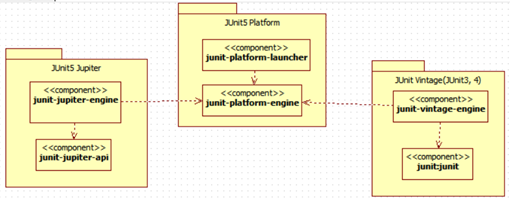

<h1>JUnit 5 기초</h1>

<h2>JUnit 5 모듈 구성</h2>

* JUnit 5는 크게 세 개의 요소로 구성되어 있다.
  * JUnit Platform : 테스팅 프레임워크를 구동하기 위한 런처와 테스트 엔진을 위한 API를 제공한다.
  * JUnit Jupiter : JUnit 5를 위한 테스트 API와 실행 엔진을 제공한다.
  * JUnit Vintage : JUnit 3, 4로 작성된 테스트를 JUnit 5 플랫폼에서 실행하기 위한 모듈을 제공한다.

* 이들 구성 요소의 주요 모듈 구조는 아래와 같다.



* JUnit 5는 테스트를 위한 API로 Jupiter API를 제공한다. Jupiter API를 사용해서 테스트를 작성하고 실행하려면 아래와 같이   
  Jupiter 관련 모듈을 의존에 추가하면 된다.
```xml
<dependencies>
    <dependency>
        <groupId>org.junit.jupiter</groupId>
        <artifactId>junit-jupiter</artifactId>
        <version>5.5.0</version>
        <scope>test</scope>
    </dependency>
    <!-- other dependencies -->
</dependencies>

<build>
    <plugins>
        <plugin>
            <artifactId>maven-surefire-plugin</artifactId>
            <version>2.22.1</version>
        </plugin>
        <!-- other plugins -->
    </plugins>
</build>
```

* JUnit5를 이용해서 테스트를 실행하려면 JUnit5 플랫폼이 제공하는 플랫폼 런처를 사용해야 한다. Maven은 `maven-surefire-plugin 2.22.0`   
  버전부터 JUnit5 플랫폼을 지원하므로 따로 플랫폼을 설정하지 않아도 된다.

* Gradle도 유사하다.
```gradle
apply plugin: 'java'
apply plugin: 'eclipse'

group 'org.tdd'
version '1.0-SNAPSHOT'
sourceCompatibility = 1.8

repositories {
    mavenCentral()
}

dependencies {
    testCompile('org.junit.jupiter:junit-jupiter:5.5.0')
}

test {
    useJUnitPlatform()
    testLogging {
        events "passed", "skipped", "failed"
    }
}
```
<hr/>

<h2>@Test 어노테이션과 테스트 메소드</h2>

* JUnit 5 모듈을 설정했다면 JUnit을 이용해서 테스트 코드를 작성하고 실행할 수 있다. JUnit 코드의 기본 구조는 간단하다.   
  테스트로 사용할 클래스를 만들고 `@Test` 어노테이션을 메소드에 붙이기만 하면 된다.
```java
public class SumTest {

    @Test
    void sum() {
        int result = 2 + 3;
        assertEquals(5, result);
    }
}
```

* 테스트 클래스의 이름을 작성하는데에 특별한 규칙은 없지만 보통 다른 클래스와의 구분을 위해 Test를 접미사로 붙인다.   
  테스트를 실행할 메소드에는 `@Test` 어노테이션을 붙이는데, 이때 테스트 메소드는 __private이면 안된다.__

* JUnit의 `Assertions` 클래스는 `assertEquals()`와 같이 값을 검증하기 위한 목적의 다양한 정적 메소드를 제공한다.
<hr/>

<h2>주요 단언 메소드</h2>

* `Assertions` 클래스는 `assertEquals()`를 포함해 아래 표의 다양한 단언 메소드를 제공한다.

<table>
    <tr>
        <td>메소드</td>
        <td>설명</td>
    </tr>
    <tr>
        <td>assertEquals(Object expected, Object actual)</td>
        <td>actual이 expected와 같은지 검사한다.</td>
    </tr>
    <tr>
        <td>assertNotEquals(Object unexpected, Object actual)</td>
        <td>actual이 특정 값(unexpected)와 같지 않은지 검사한다.</td>
    </tr>
    <tr>
        <td>assertSame(Object expected, Object actual)</td>
        <td>두 객체가 동일한 객체인지 검사한다.</td>
    </tr>
    <tr>
        <td>assertNotSame(Object unexpected, Object actual)</td>
        <td>두 객체가 동일하지 않은 객체인지 검사한다.</td>
    </tr>
    <tr>
        <td>assertTrue(boolean condition)</td>
        <td>값이 true인지 검사한다.</td>
    </tr>
    <tr>
        <td>assertFalse(boolean condition)</td>
        <td>값이 false인지 검사한다.</td>
    </tr>
    <tr>
        <td>assertNull(Object actual)</td>
        <td>값이 null인지 검사한다.</td>
    </tr>
    <tr>
        <td>assertNotNull(Object actual)</td>
        <td>값이 null이 아닌지 검사한다.</td>
    </tr>
    <tr>
        <td>fail()</td>
        <td>테스트를 실패 처리한다.</td>
    </tr>
</table>

* 주요 타입별로 `assertEquals()` 메소드가 존재한다. 주의점은 첫 번째 인자가 기대하는 값이고, 두 번째 인자가 검사하려는 값이라는 점이다.

* `assertEquals(Object expected, Object actual)` 메소드는 `equals()` 메소드를 이용해서 두 객체가 같은지를 비교한다.

* `fail()` 메소드는 테스트에 실패했음을 알리고 싶을 때 사용한다. 아래는 예시이다.
```java
try {
    AuthService service = new AuthService();
    service.authenticate(null, null);
    fail();  // 이 지점에 다다르면 이 메소드의 테스트 실패 에러를 발생시킨다.
} catch(IllegalArgumentException exception){}
```

* 만약 Exception의 발생 유무가 검증 대상이라면 `fail()` 보다는 아래의 두 메소드를 사용하는 것이 더욱 명시적이다.

<table>
    <tr>
        <td>메소드</td>
        <td>설명</td>
    </tr>
    <tr>
        <td>assertThrows(Class&lt;T&gt; expectedType, Executable executable)</td>
        <td>executable을 실행한 결과로 지정한 타입의 예외가 발생하는지 검사한다.</td>
    </tr>
    <tr>
        <td>assertDoesNotThrow(Executable executable)</td>
        <td>executable을 실행한 결과로 예외가 발생하지 않는지 검사한다.</td>
    </tr>
</table>

* 아래는 `assertThrows()`를 이용해서 지정한 예외가 발생하는지 검사하는 코드이다.
```java
assertThrows(IllegalArgumentException.class,
    () -> {
        AuthService service = new AuthService();
        service.authenticate(null, null);
    });
```

* `assertThrows()` 메소드는 발생한 `Exception` 객체를 반환한다. 발생한 `Exception`을 이용해서 추가로 검증이 필요하면   
  반환된 `Exception` 객체를 사용하면 된다.
```java
IllegalArgumentException thrown = assertThrows(IllegalArgumentException.class,
    () -> {
        AuthService service = new AuthService();
        service.authenticate(null, null);
    });
assertTrue(thrown.getMessage().contains("id"));
```

* 참고로 `assertThrows()`와 `assertDoesNotThrow()` 메소드에서 사용하는 `Executable` 인터페이스는 아래와 같이 `execute()`   
  메소드를 가진 함수형 인터페이스이다.
```java
public interface Executable {
    void execute() throws Throwable;
}
```

* assert 메소드는 실패하면 다음 코드를 수행하지 않고 바로 예외를 발생시킨다. 하지만 경우에 따라 일단 모든 검증을 실행하고   
  그중에 실패한 것이 있는지 확인해야할 때가 있다. 이럴 때 사용하는 것이 `assertAll()` 메소드이다. 아래는 예시이다.
```java
assertAll(
    () -> assertEquals(3, 5 / 2),
    () -> assertEquals(4, 2 * 2),
    () -> assertEquals(6, 11 / 2)
);
```

* `assertAll()` 메소드는 `Executable` 목록을 가변인자로 전달받아 각 `Executable`을 실행한다.   
  실행 결과로 검증에 실패한 코드가 있으면 그 목록을 모아서 에러 메시지로 띄워준다.
<hr/>

